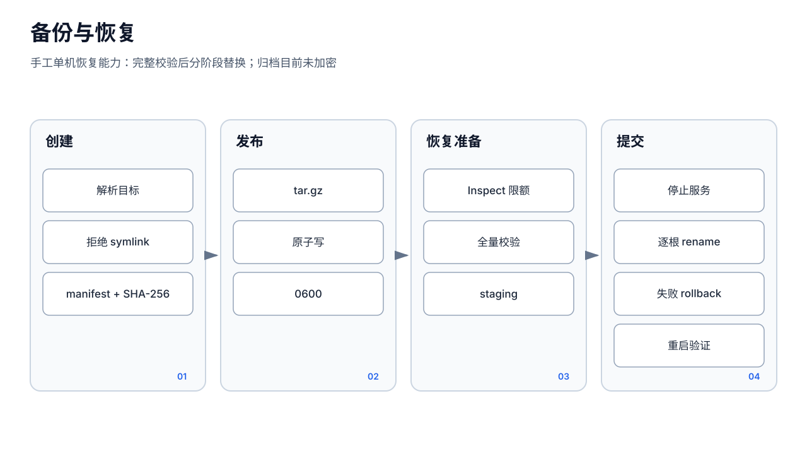

# 备份与恢复

`26.8.2v1` 提供 CLI 备份。归档格式为 gzip 压缩 tar，首项是 `manifest.json`，每个文件记录 SHA-256、大小、权限和修改时间。它提供完整性检查与路径防护，但**不提供加密**。



## 备份范围

命令根据当前配置和显式工作目录解析四个根：

- `config`：当前配置文件
- `agents/`：`agents.dir` 指向的成员数据
- `projects/`：运行工作目录下的项目数据
- `cron/`：运行工作目录下的 Cron 及其相关持久化数据

这不是整机备份。反向代理配置、TLS 私钥、systemd/launchd 定义、外部 SecretRef 文件、环境变量、外部数据库或其他自建目录不在归档中，必须单独备份。

## 创建

先确定服务的真实配置路径和 WorkingDirectory：

```bash
sudo install -d -m 700 /var/backups/zyhive
sudo zyhive backup create \
  --output /var/backups/zyhive/zyhive-$(date +%Y%m%d-%H%M%S).tar.gz \
  --config /etc/zyhive/zyhive.json \
  --workdir /etc/zyhive
```

输出不能位于任一备份源内部。创建过程使用输出目录内的 `0600` 临时文件，完成同步后原子改名。源中出现符号链接、特殊文件、缺少必需目录，或文件在读取过程中变化时会失败。

在线创建只能检测单文件扫描期间的变化，不能保证配置、Session、Cron、Goal 和任务恰好属于同一时刻。高一致性要求下先停止服务再备份：

```bash
sudo systemctl stop zyhive
sudo zyhive backup create \
  --output /var/backups/zyhive/offline.tar.gz \
  --config /etc/zyhive/zyhive.json \
  --workdir /etc/zyhive
sudo systemctl start zyhive
```

macOS 将 systemd 命令替换为对应的 `launchctl stop/start com.zyhive.zyhive`。

## 检查

每次复制或上传后执行完整检查：

```bash
zyhive backup inspect \
  --input /var/backups/zyhive/offline.tar.gz \
  > /var/backups/zyhive/offline.manifest.json
```

`inspect` 会检查归档大小、条目数、必需根、路径穿越、重复项、类型、权限、时间、大小和每个文件的 SHA-256。默认上限包括 16 GiB 归档/总解压大小、4 GiB 单文件和 1,000,000 个条目。

## 未加密警告

归档可能直接包含管理员 Token、Provider API Key、渠道凭据和全部业务内容。gzip 不是加密；manifest/SHA-256 也不提供机密性或来源认证。

- 归档及 manifest 权限设为 `0600`。
- 使用受控加密存储、加密卷或外部加密工具。
- 加密后保留解密材料的独立恢复流程。
- 不把明文备份上传到普通对象存储、聊天或工单。

## 恢复前演练

1. 在目标机安装与归档 `appVersion` 兼容的 ZyHive。
2. 使用 `inspect` 完整验证。
3. 确认目标配置路径和工作目录；传错 `--workdir` 会覆盖错误位置。
4. 单独备份当前现场和 SecretRef 外部文件。
5. 确认磁盘空间、属主和服务管理方式。

## 恢复

恢复是覆盖操作，必须提供 `--yes`：

```bash
sudo zyhive backup restore \
  --input /var/backups/zyhive/offline.tar.gz \
  --yes \
  --config /etc/zyhive/zyhive.json \
  --workdir /etc/zyhive
```

CLI 会先验证归档，再停止 `zyhive` 服务，二次验证并在各目标相邻目录暂存，然后依次替换 `config`、`agents`、`projects`、`cron`，最后重新启动服务。配置恢复时强制使用 `0600`。替换失败会尝试恢复刚移开的旧目标。

外部进程管理器使用：

```bash
# 先由外部管理器停止服务
zyhive backup restore ... --yes --no-service
# 再由外部管理器启动服务
```

恢复提交由多次 rename 构成，没有掉电事务日志；恢复期间断电仍可能形成跨目录不一致。因此恢复必须离线执行，并保留恢复前现场副本。

## 恢复验收

```bash
curl -fsS http://127.0.0.1:8080/healthz
curl -fsS http://127.0.0.1:8080/readyz
```

随后验证管理员登录、成员列表、项目、Cron 和一条只读业务旅程。SecretRef 指向的环境变量/文件不在归档中，缺失时服务会在配置加载阶段失败。

## 建议策略

- 每日备份，至少保留 7 个日版本和 4 个周版本。
- 每次升级前创建离线备份。
- 每月在隔离环境执行一次完整恢复演练。
- 同时保留一个与数据兼容的旧二进制和安装资产。

以上是运维建议，不是产品内建保留策略、加密或灾备保证。
