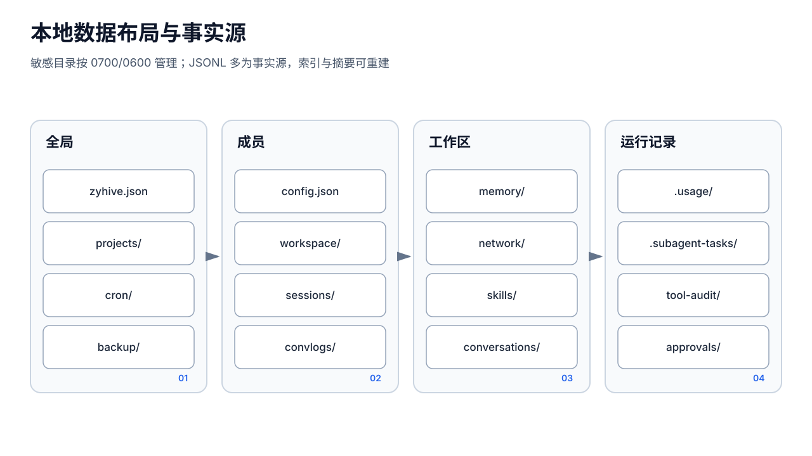

# 配置

ZyHive `26.8.2v1` 的当前配置 schema 为 `configVersion: 3`。服务通过 `--config FILE` 或 `AIPANEL_CONFIG` 指定配置；未指定时命令行默认查找 `aipanel.json`。安装器生成的文件名是 `zyhive.json`。



## 最小配置

```json
{
  "configVersion": 3,
  "gateway": {
    "port": 8080,
    "bind": "localhost",
    "publicUrl": "https://zyhive.example.com"
  },
  "agents": {
    "dir": "/var/lib/zyhive/agents"
  },
  "providers": [],
  "models": [],
  "channels": [],
  "tools": [],
  "skills": [],
  "auth": {
    "mode": "token",
    "token": "replace-with-random-token"
  }
}
```

`gateway.bind` 接受 `localhost`、`lan`、`all` 或合法 IP。空值会迁移为 `lan`；生产反向代理推荐显式使用 `localhost`。端口和管理 Token 修改后需要重启进程才对监听器和已构造的鉴权中间件生效。

## SecretRef

敏感字符串字段可引用环境变量或文件：

```json
{
  "providers": [
    {
      "id": "anthropic-main",
      "name": "Anthropic",
      "provider": "anthropic",
      "apiKey": "{\"$env\":\"ANTHROPIC_API_KEY\"}",
      "status": "untested"
    }
  ],
  "auth": {
    "mode": "token",
    "token": "{\"$file\":\"/run/secrets/zyhive_admin_token\"}"
  }
}
```

重要：配置结构中的凭据字段类型仍是 JSON 字符串，因此 SecretRef 对象要作为**字符串化 JSON**保存，而不是直接写成对象。

支持解析的位置：

- `providers[].apiKey`
- `models[].apiKey`（兼容旧配置）
- `tools[].apiKey`
- `channels[].config` 的所有字符串值
- `auth.token`

语义：

- `{"$env":"NAME"}`：读取非空环境变量；未设置或空值会导致配置加载失败。
- `{"$file":"/path"}`：读取文件，并去掉末尾 CR/LF；不可读会导致配置加载失败。
- 运行时解析同时含 `$env` 与 `$file` 的对象时会优先 `$env`；但保存路径的 SecretRef 识别只接受单键形式，双键对象不能可靠往返，视为不受支持。两者都未指定或含未知键的对象会按普通值保留。
- 常规配置保存会尽量保留磁盘上的 SecretRef 表示，而运行时使用解析后的明文。

systemd 环境变量可通过管理员自建的 `EnvironmentFile=` 注入；文件应为 root/服务账户可读且 `0600`。launchd 可使用 plist 的 `EnvironmentVariables`，但更推荐 `$file` 引用受限文件，避免秘密直接进入 plist。

## 权限

```bash
sudo chown root:root /etc/zyhive/zyhive.json
sudo chmod 600 /etc/zyhive/zyhive.json
sudo chmod 700 /var/lib/zyhive /var/lib/zyhive/agents
```

用户安装对应文件应只归当前用户。程序的新配置保存使用同目录临时文件、文件锁和原子替换，并以 `0600` 写入；不要把配置放在不支持正常 rename/lock 语义的共享存储上。

## 日志环境变量

- `LOG_FORMAT=text|json`，默认 `text`
- `LOG_LEVEL=debug|info|warn|error`，默认 `info`

生产日志聚合通常使用：

```ini
Environment=LOG_FORMAT=json
Environment=LOG_LEVEL=info
```

## 修改流程

1. 创建配置和数据备份。
2. 校验 JSON：`python3 -m json.tool /path/to/zyhive.json >/dev/null`。
3. 保持文件权限为 `0600`。
4. 重启服务。
5. 验证 `/healthz`、`/readyz`，再执行一次需鉴权的 API 请求。

配置加载会自动执行旧 schema 迁移并可能回写文件。升级前必须备份；不要手工降低 `configVersion`。

## 不存在的能力

`auth.mode: "token"` 是单一管理员 Bearer Token，不提供多用户、角色、资源级权限或 RBAC。`toolPolicy` 的 allow/deny/ask 是 Agent 工具调用策略，不应被解释为管理平面的 RBAC。
