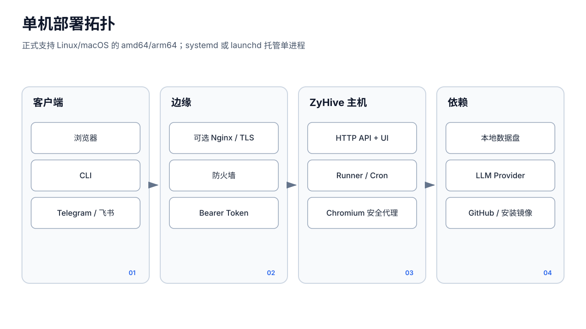

# 部署

本文以 `26.8.2v1` 为基线。正式 Release 仅提供 Linux/macOS 的 amd64、arm64 四个目标，不支持 32 位 ARM 和 Windows。



## 安装前检查

- 具备 `curl` 或 `wget`；安装器会尝试通过 apt、yum、dnf、apk 或 brew 补装 `curl`。
- 系统安装需要 root 或 sudo；没有权限时会降级到用户目录。
- 默认端口为 `8080`。使用域名时准备 DNS、80/443 端口和 TLS 终止。
- 生产部署应先确定配置、数据、备份和日志所在文件系统的容量与权限。

## 推荐安装

固定版本可以避免安装期间 latest 指针变化：

```bash
curl -fsSL https://install.zyling.ai/install -o /tmp/zyhive-install.sh
ZYHIVE_VERSION=26.8.2v1 \
ZYHIVE_VERIFY_SIGNATURE=1 \
bash /tmp/zyhive-install.sh --verify-signature --bind localhost --skip-setup
```

严格签名模式要求本机已安装 `cosign`。不启用时仍会强制核对同一发布版本的 `SHA256SUMS` 和二进制内嵌版本，但不会验证发布者身份。

常用参数：

- `--port PORT`：监听端口。
- `--bind localhost|lan|all|IP`：监听范围；生产反代推荐 `localhost`。
- `--no-root`：强制用户目录安装。
- `--no-service`：不注册系统服务，适合外部进程管理。
- `--domain example.com`：Linux 系统安装时尝试配置 NGINX、Certbot 和 HTTPS。
- `--skip-setup`：跳过交互向导。
- `--yes`：使用默认选择进行非交互安装。

## 路径矩阵

系统安装：

- 二进制：`/usr/local/bin/zyhive`
- Linux 配置：`/etc/zyhive/zyhive.json`
- macOS 配置：`/usr/local/etc/zyhive/zyhive.json`
- 成员目录：`/var/lib/zyhive/agents`

用户安装：

- 二进制：`~/.local/bin/zyhive`
- 配置：`~/.config/zyhive/zyhive.json`
- 成员目录：`~/.local/share/zyhive/agents`

安装器创建的配置文件权限为 `0600`。配置的 `agents.dir` 决定成员数据位置；运行工作目录还承载 `projects/`、`cron/` 等数据，因此不要随意改变服务的 WorkingDirectory。

## Linux：systemd

系统安装器写入 `/etc/systemd/system/zyhive.service`，核心行为是：

```ini
[Service]
Type=simple
ExecStart=/usr/local/bin/zyhive --config /etc/zyhive/zyhive.json
WorkingDirectory=/etc/zyhive
Restart=always
RestartSec=2
StandardOutput=journal
StandardError=journal
```

管理命令：

```bash
sudo systemctl status zyhive
sudo systemctl restart zyhive
sudo journalctl -u zyhive -f
```

安装器生成的 unit 没有专用 `User=`，系统安装会以 root 运行。生产环境若改为独立低权限账户，必须同时迁移并授权配置、成员目录、工作目录和二进制更新权限；在线更新需要替换当前可执行文件。

## macOS：launchd

系统安装使用：

- plist：`/Library/LaunchDaemons/com.zyhive.zyhive.plist`
- 日志：`/var/log/zyhive/stdout.log`、`stderr.log`
- `RunAtLoad=true`、`KeepAlive=true`

用户安装使用：

- plist：`~/Library/LaunchAgents/com.zyhive.zyhive.plist`
- 日志：`~/Library/Logs/zyhive/stdout.log`、`stderr.log`
- 用户登录后启动

```bash
# 系统级
sudo launchctl stop com.zyhive.zyhive
sudo launchctl start com.zyhive.zyhive

# 用户级
launchctl stop com.zyhive.zyhive
launchctl start com.zyhive.zyhive
```

## 外部进程管理

使用 `--no-service` 时手动启动：

```bash
/path/to/zyhive --serve --config /path/to/zyhive.json
```

外部管理器必须提供持久工作目录、重启策略、标准输出收集和优雅停止。备份恢复时使用 `--no-service`，并由外部管理器负责停启。

## 部署验收

```bash
zyhive --version
curl -fsS http://127.0.0.1:8080/healthz
curl -fsS http://127.0.0.1:8080/readyz
```

`/healthz` 应返回 HTTP 200、`status: "ok"` 和 `version: "26.8.2v1"`。`/readyz` 可能因 Cron 未启动、会话积压或已探测 Provider 全部失败返回 503；需要结合响应中的 `checks` 排查。

部署完成后立即备份管理员 Token，并从非授权网络验证端口不可达。ZyHive 没有内建 HA 或多节点协调；同一数据目录不得由多个实例并发挂载。
