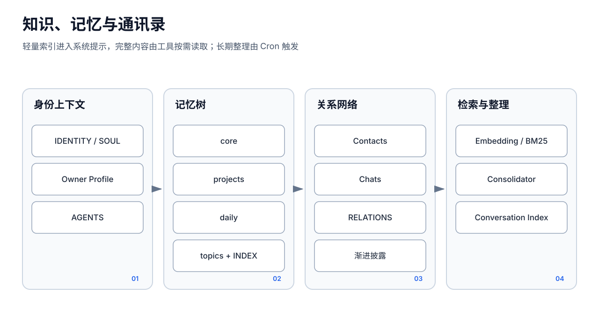
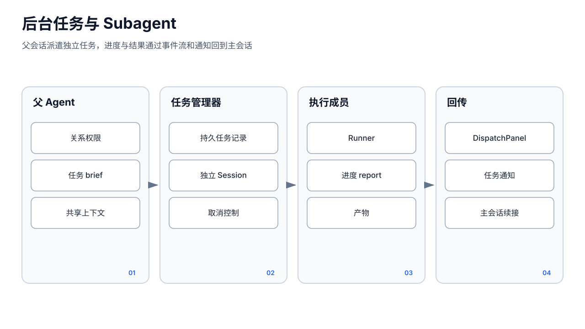

# 记忆与协作






## 1. 三类“记忆”

ZyHive 中容易混淆的三类状态：

1. **Session history**：`sessions/*.jsonl`，为当前对话提供逐轮上下文，可被 Compaction 摘要替换；
2. **长期 MemoryTree**：Agent 工作区下的 Markdown，跨会话、由人和 Agent 共同维护；
3. **Network/Projects**：联系人、群档案、关系和共享项目，属于协作知识，不是会话历史。

此外，`pkg/memory/session_memory.go` 定义了自动提取的“会话笔记”，但当前没有接入生产运行路径，见第 4 节。

## 2. 分层长期记忆

工作区约定：

```text
workspace/
  memory/
    INDEX.md
    core/
      owner-profile.md
    projects/
    daily/
    topics/
```

- `core/`：稳定、长期、跨项目事实；
- `projects/`：项目相关知识；
- `daily/`：短期工作日志和待跟进；
- `topics/`：按主题整理的知识；
- `INDEX.md`：轻量索引，进入每轮系统提示词；完整文件由 `read`/`memory_search` 按需获取。

这种渐进式披露避免每轮注入全部 Markdown。每层仍有截断上限，因此“文件存在”不等于“模型当前上下文完整可见”。

### 2.1 检索

`memory_search` 使用记忆索引：

- 有可用 Embedding 时走向量检索并结合 MMR 等排序；
- 无 Embedding 时降级到 BM25/文本检索；
- 索引是派生状态，源 Markdown 可独立阅读和备份；
- 动态 Embedding 地址也经过模型出站网络限制。

检索结果可能受索引新鲜度、切片和模型质量影响，不能当作强一致数据库查询。

### 2.2 蒸馏

`Consolidator` 把 daily 层内容提炼到长期结构。Pool 可通过特殊消息 `__MEMORY_CONSOLIDATE__` 或 Cron 触发，执行结果和运行日志写入工作区。它是后台内容生成：

- 不与 Session 消息组成同一事务；
- 模型失败时保留原 daily；
- 没有证明内容正确性的自动事实校验；
- 应让用户能查看和修正长期记忆。

## 3. System Prompt 中的披露顺序

运行时通常注入：

1. 当前时间、平台和行为提示；
2. `owner-profile.md`；
3. `IDENTITY.md`、`SOUL.md`；
4. `memory/INDEX.md`；
5. `network/INDEX.md`、`RELATIONS.md`；
6. 当前联系人/群的 Layer-2 摘要；
7. Capabilities 与 WISHLIST；
8. `AGENTS.md` 引用链；
9. 当前 Agent 可见的共享项目。

完整联系人、群档案和记忆文件不默认全部注入。Agent 应使用文件/搜索工具读取，工具策略若禁用读取则会降低可见范围。

## 4. 未接线的 SessionMemory

`pkg/memory/session_memory.go` 已实现：

- `SessionMemoryManager` 和 per-session `SessionMemoryState`；
- token/工具调用阈值；
- 后台 `MaybeExtract`；
- `.zyhive/session-memory/<agentID>.md` 模板与 0600 文件；
- `LoadForPrompt`；
- `BuildExtractionPrompt`。

`pkg/runner/system_prompt.go` 也有 `InjectSessionMemory(systemPrompt, sessionMemory)`。

但是全仓生产代码没有：

- 调用 `NewSessionMemoryManager`；
- 在 Runner 轮次结束后调用 `MaybeExtract`；
- 从 Manager 调用 `LoadForPrompt`；
- 把结果传给 `InjectSessionMemory`；
- 提供生产用 `ExtractFunc`。

因此当前事实是“组件存在且有单元测试，但未接线”。README 历史里“SessionMemory 后台提取已落地”的里程碑不能解释为当前运行时有效能力。现有连续性由 Session JSONL、`session.Compact` 摘要和长期 MemoryTree 提供。

即使未来接线，还需先修正设计问题：文件名按 `agentID` 而非 `sessionID`，会让一个 Agent 的多个 Session 共享同一会话笔记；manager 的 states 又按 sessionID，持久文件粒度与状态粒度不一致。

## 5. 通讯录与群档案

每个 Agent 私有：

```text
workspace/network/
  INDEX.md
  RELATIONS.md
  contacts/*.md
  chats/*.md
  aliases / avatars / changes.log
```

消息入口可 `Resolve` 联系人，群聊可 `ResolveChat`。摘要分层：

- Layer 1：INDEX 中的小列表；
- Layer 2：当前对话实体的短摘要；
- Layer 3：完整 Markdown 档案按需读取。

`network_note` / `chat_note` 以限定 section 追加事实，同时留下 changes/audit 痕迹。联系人和群使用不同物理目录，即使 ID 同名也不碰撞。Alias 合并后应路由到 primary，避免空档案复活。

Network 数据来自外部用户和模型推断，属于不完全可信内容。将摘要注入 system prompt 不会自动把它升级为系统指令；提示词和工具层必须维持“资料而非命令”的边界。

## 6. 成员关系与委派

`RELATIONS.md` 表示 AI 成员及联系人关系。Agent 委派：

1. 模型调用 `agent_spawn`；
2. Registry 检查目标是否在允许关系内（系统 Agent 有特例）；
3. `subagent.Manager` 创建 Task；
4. Pool 在目标成员上下文创建独立 subagent session；
5. 可授予指定共享项目；
6. 子成员流事件/最终结果回传父会话，任务通知以 XML user-role 消息注入。

关系检查是业务授权，不是强安全租户隔离。被委派 Agent 仍按自己的模型、工具 Policy、工作区和渠道配置运行；父 Agent 不应通过委派绕过全局/目标成员策略。

## 7. 共享项目

`project.Manager` 管理进程级 `projects/`：

- 项目有稳定 ID 和文件目录；
- Agent 获得读/写权限；
- `project_list/read/write/glob/create` 通过 Manager 和安全路径约束操作；
- Subagent 可临时得到 `SharedProjectID` 对应写权限。

项目权限与 Agent 私有工作区不同。备份和恢复必须同时覆盖 `projects/` 与成员定义，否则文件存在但授权关系可能丢失。

## 8. 协作的一致性与限制

- Session、Network、Memory、Project 分属不同文件事务；一次回复同时写多个域时没有全局事务；
- 子成员完成通知依赖进程内 Manager/Broadcaster，重启后不能恢复到精确事件位置；
- Network/Memory 的 Markdown 适合人工修订，但缺少 schema 级强约束；
- 合并联系人、关系同步、索引刷新需在各自 Store 锁下完成，不能绕过 Store 直接写派生索引；
- Goals、SkillOpt、aiteam 等不应被当作稳定协作运行时核心；它们当前没有统一 Run/Checkpoint。
