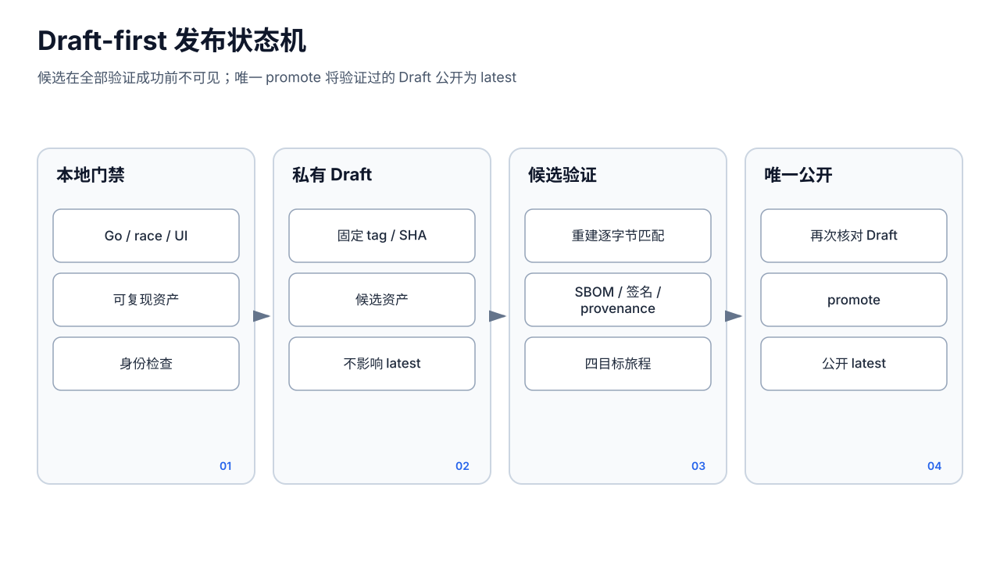

# 发布架构




## 1. 目标

发布系统要保证“未经完整验证的资产永不成为公开 latest”。当前正式流程采用 Draft-first，而不是先公开、失败后撤回。

核心状态机：

```text
main 上的精确候选 SHA
  → 本地预检与四平台资产
  → GitHub 私有 Draft Release
  → Release E2E 全门禁
      ├─ 任一失败：保持 Draft，不影响原 latest
      └─ 全部成功：唯一 promote Job 执行 Draft → Published/latest
```

Draft 不可见期间也可由 GitHub Actions 用仓库 token 下载资产并补充 SBOM/签名。

## 2. 源码门禁

`.github/workflows/ci.yml` 在 PR 和 main push 上运行：

- Commit identity；
- `go vet`、全仓 `go test`、`go build`；
- 关键包 `go test -race`；
- golangci-lint（当前 advisory，不阻断）；
- Node 22 的 UI test/typecheck/build；
- `ui/dist` 与 `cmd/aipanel/ui_dist` 一致性；
- Shell 语法、供应链契约、Draft-first 契约；
- 本地 Release smoke：安装、API、更新；
- main push 后四平台 release build。

受保护分支要求的检查与工作流文件必须同步维护。Advisory lint 成功不能表述为“无 lint 问题”。

## 3. 候选创建

`scripts/release.sh` 的关键约束：

1. 必须从 main；
2. 版本 Release 不得已存在；
3. 记录上一个非 draft、非 prerelease 的稳定版本；
4. 构建 Linux/macOS × amd64/arm64 四个 CGO-disabled 二进制；
5. 生成 `SHA256SUMS`，带上 `install.sh`；
6. `gh release create ... --draft --target <HEAD>`；
7. 获取 `candidate_sha` 和不可变的 Release database ID；
8. 触发 `release-e2e.yml workflow_dispatch`；
9. 等待工作流；失败时明确报告 Draft 保持不可见；
10. 工作流成功后再次确认 draft=false 才报告发布成功。

Tag/Release 目标必须精确绑定候选 SHA，避免重新打 tag、VCS metadata 或错误 target 使资产与源码不对应。

## 4. Release E2E 输入与并发

工作流输入：

- `version`：现有 Draft tag；
- `candidate_sha`：构建该 Draft 的 main commit；
- `release_id`：现有私有 Draft database ID；
- `previous_version`：真实更新测试的上一稳定版。

并发 group 按 version，`cancel-in-progress:false`。这样同一候选不会因后续触发被中途取消并留下难以判断的发布状态。

## 5. 供应链 Job

`supply-chain`：

1. checkout 精确 `candidate_sha`；
2. 验证运行来源为 main、Release 仍为 Draft、tag/target/release ID 均匹配；
3. 验证提交身份和候选 SHA 是 origin/main 祖先；
4. 下载 Draft 中的四平台二进制、install.sh、SHA256SUMS；
5. 校验 checksum；
6. 使用 Node 22 重建 UI；
7. 用固定 Go、`-buildvcs=false -trimpath` 和版本 ldflags 重建四平台资产；
8. 对每个二进制执行 `cmp`，证明候选可复现；
9. 生成 SPDX SBOM；
10. 用 GitHub OIDC/Sigstore 生成签名 bundle；
11. 生成 GitHub build provenance attestation；
12. 上传 SBOM/bundle 回同一 Draft；
13. 重新下载全部文件，验证签名与 attestation；
14. 作为短期 Actions artifact 提供给原生 Runner。

工具版本固定，升级 Syft/Cosign/Actions 必须经代码审查，避免供应链行为静默漂移。

## 6. 四平台原生旅程

矩阵：

- Ubuntu amd64；
- Ubuntu arm64；
- macOS Intel；
- macOS arm64。

每个平台下载同一 verified candidate，验证 checksum，并运行 `scripts/test/release-e2e/run.sh local`。旅程覆盖：

- 全新安装与启动；
- 鉴权和核心 API；
- 成员、工作区、项目、Cron/Goal 等核心状态；
- 真实上一稳定版更新；
- 配置和用户数据保持；
- 错误 checksum 拒绝；
- 二进制备份；
- 更新后新进程健康/版本确认；
- 健康失败由独立 watchdog 恢复 `.bak`；
- 完整备份 manifest/摘要、破坏后恢复与重启；
- 路径穿越、符号链接和损坏归档拒绝。

原生 Runner 很重要：交叉编译成功不能证明目标 OS 的服务注册、权限、文件锁、安装路径和更新替换正确。

## 7. 唯一公开转换

`promote` 仅依赖 supply-chain 与全部 candidate-install-update：

1. 再次验证 Release 仍是相同 ID 的 Draft；
2. 再次验证 tag 和 target 为 candidate SHA；
3. 执行唯一写操作：

```text
gh release edit <version> --draft=false --latest
```

没有其他 Job 应发布或设 latest。门禁失败时工作流自然停止，旧稳定版保持 latest，安装镜像和用户不会看到失败候选。

## 8. 安装和在线升级信任链

安装器与 Web 在线更新共享“下载目标平台资产并校验 SHA-256”的基础，但后续保证不同：

- 从正式 latest/指定版本获取资产；
- 下载目标平台二进制和 `SHA256SUMS`；
- 严格校验后才替换；
- 安装器负责安装/覆盖、配置保留和服务注册，不运行 watchdog 健康确认；
- 只有管理 API 驱动的在线更新会保留 `.bak`、写 pending 记录，并由 watchdog 检查 `/healthz` 和预期版本；
- 在线更新确认失败或失联时尝试恢复旧二进制并终止失败进程。

对在线更新而言，“文件替换成功”不是升级成功；只有新进程健康且版本匹配才完成。安装器路径没有同等级别的自动健康回滚，部署者应自行检查服务状态并保留备份。

## 9. 版本与可复现性

当前公开版本使用日期式 `YY.M.DvN`。候选构建必须：

- 使用精确版本字符串；
- 禁用会因 checkout/tag 时序变化的 VCS build metadata；
- 固定 Go/Node 和关键供应链工具；
- UI 先构建并同步；
- 同一候选不得在验证中被重新替换为“相同版本的新文件”而不重新走完整门禁。

`--clobber` 仅用于同一 Draft 中由受控 Job 上传 SBOM/signature；基础二进制的不可变性由下载、重建 `cmp` 和 Release ID/SHA 校验共同保证。

## 10. 权限边界

- 普通 CI 默认 `contents:read`；
- supply-chain 仅在需要上传/attest 时获得 `contents:write`、`id-token:write`、`attestations:write`；
- promote 仅需 `contents:write`；
- checkout 默认尽量不持久化凭据；
- 签名使用 OIDC，不在仓库存储长期私钥。

Release 脚本操作者仍需要触发和创建 Draft 的 GitHub 权限；受保护 main 和唯一身份策略是前置条件。

## 11. 失败处理

- 创建 Draft 前失败：无 Release；
- Draft 创建后工作流未找到/失败：保留不可见 Draft，人工审查或删除；
- supply-chain 上传部分文件后失败：仍为 Draft，不公开；
- 某一个平台失败：promote 不运行；
- promote 前候选 target/draft 被篡改：校验失败；
- publish 后镜像/官网更新：必须以公开 Release 为事实源，不能提前跟随 Draft。

失败 Draft 不应复用为另一 candidate SHA。重新发布应使用新版本或按明确、可审计流程重建完整候选。

## 12. 当前限制

- lint 仍是 advisory；
- 发布 E2E 很强，但不能替代长期运行、真实 Provider/渠道兼容和全部前端旅程；
- Sigstore/attestation 验证依赖 GitHub 身份和在线透明日志；
- 单二进制可复现不代表所有外部依赖响应可复现；
- Draft-first 保护分发时序，不修复应用运行时的数据一致性；
- Windows 不在当前四平台正式矩阵。
