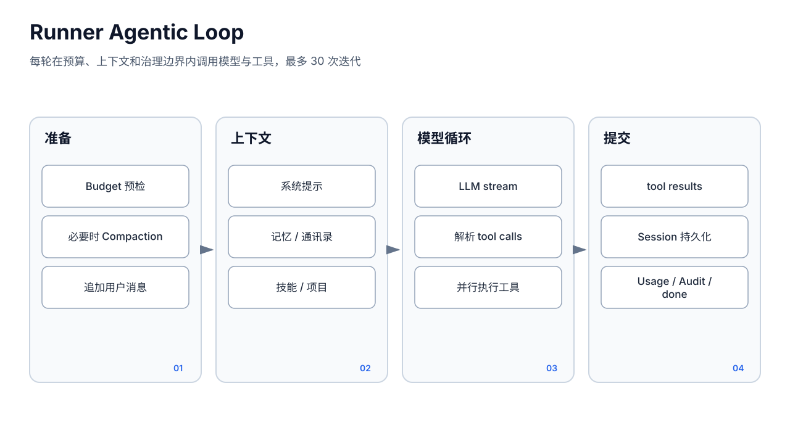
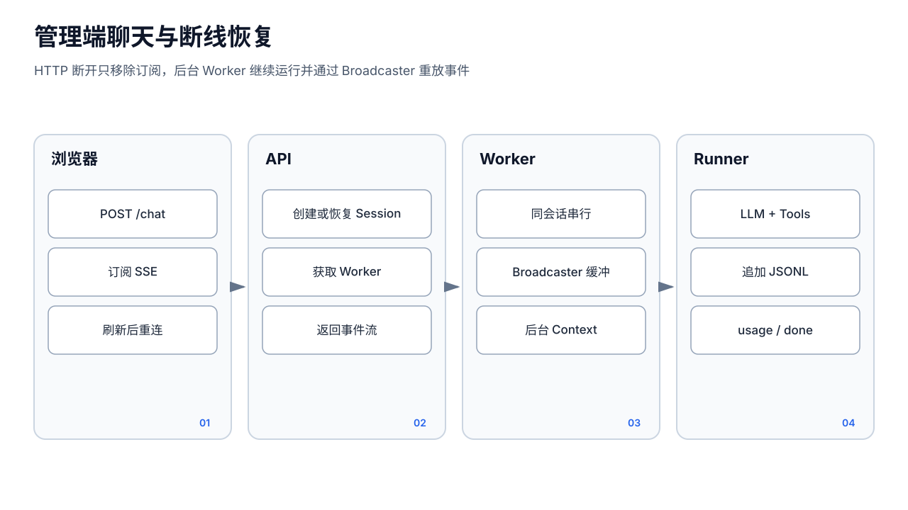

# 运行时与 Agent 循环






## 1. Runner 的职责

`pkg/runner.Runner` 是一次对话执行器，不是长期持久化 Agent。`runner.New(Config)` 加载会话历史或兼容的预载历史，`Run(ctx, userMsg)` 启动 goroutine 并返回 `<-chan RunEvent`。

`runner.Config` 的关键字段：

- `AgentID`、`WorkspaceDir`：身份和文件能力边界；
- `Model`、`Provider`、`APIKey`、`LLM`、`SupportsTools`：模型调用；
- `Tools`：已经动态注册并完成治理的 `tools.Registry`；
- `Session`、`SessionID`、`PreloadedHistory`：历史来源与持久化；
- `ProjectContext`、`CurrentSessionContext`、`CapabilitiesContext`、`ExtraContext`：系统提示词层；
- `UsageRecorder`、`BudgetCheck`、`ToolAudit`：计费、运行前刹车和工具审计。

Runner 当前还承担历史修复、压缩、提示词构建、模型重试/节流下层接入、工具循环、持久化、用量、自动标题等多项职责，因此不是可独立恢复的状态机。

## 2. 单轮执行数据流

```text
Run(user message)
  1. 预算/基本配置检查
  2. 从 Session 读取 history 与 compaction summary
  3. 构建分层 system prompt
  4. 若达到阈值，在本轮开始同步 Compact，再重新加载 history
  5. 追加并持久化 user message
  6. 调 LLM.Stream
  7. 转发 text/thinking/tool_call/usage/error 事件
  8. 若无工具调用：持久化 assistant，记录 usage，发 done，触发异步 retitle
  9. 若有工具调用：并行 Execute，按原顺序追加 tool results，回到步骤 6
```

循环有最大迭代和上下文预算保护；部分模型不支持工具时不会暴露工具定义。LLM 层把 Provider 差异归一为 `StreamEvent`，重试只用于识别为瞬时的错误，认证、内容过滤、上下文长度等业务错误直接上抛。

## 3. RunEvent 契约

主要事件：

- `text_delta`、`thinking_delta`；
- `tool_call`，携带 `llm.ToolCall`；
- `tool_result`，必须携带 `ToolCallID`，前端不能依赖到达顺序匹配；
- `usage`；
- `compaction_start`、`compaction_end`；
- `error`；
- `done`，携带 session、token estimate 和可能的 token 统计。

事件是当前进程内流，不是持久化 Event Store。管理端 Broadcaster 只保存当前 generation 的内存缓冲；服务重启后只能从 Session JSONL 重建消息，不能重放完整 thinking、增量、审批等待和中间工具状态。

## 4. 工具循环与并发

`executeTools` 为模型同一响应中的每个 tool call 启动 goroutine，以 `WaitGroup` 等待全部结束：

- 执行结果写入固定 slot；
- 最终按原始调用顺序组装给模型，满足 Provider 协议；
- `tool_result` 也在汇总阶段按原顺序发出；
- 工具完整输入/结果写 `toolaudit`，UI 会话仅保留展示用截断/结构记录。

重要限制：当前所有工具调用都并行，包括可能写同一文件、发送消息、修改配置或创建进程的副作用工具。Registry 尚无被 Runner 消费的 `ReadOnly/ParallelSafe/SideEffect` 元数据，也没有按冲突域串行化。策略/审批解决“能否执行”，不解决“能否并发”。调用方应避免让模型在同一批次发出相互依赖的写操作。

## 5. 管理端聊天路径

管理端 `POST /api/agents/:id/chat` 不调用 `agent.Pool.RunStream*`。它在 `internal/api/chat.go` 中：

1. 解析 Agent 和模型；
2. `Store.GetOrCreate`；
3. 以 `{agentID, sessionID}` 获取 Worker；
4. 捕获请求参数形成 `RunFn`；
5. Worker 后台调用 `chatHandler.execRunner`；
6. `execRunner` 自行创建 `llm.Client`、`tools.Registry`、web file sender、Policy/Approval、Usage/Budget、上下文和 `runner.Runner`。

这个路径的特点：

- HTTP 断开不取消 Runner；SSE 可重连；
- 管理端可注入 scenario、skill-studio、images、legacy history 和页面 context；
- web file sender 生成短时 Artifact 下载/媒体票据；
- 工具装配代码与 Pool 有重复，新增 Pool 能力不会自动出现在管理端。

## 6. Pool 路径

`agent.Pool` 服务于多种非管理端入口：

- `Run`：阻塞收集文本，用于 Heartbeat、简单内部调用等；未指定持久 session 时生成仅用于工具所有权的 `run-*` ID；
- `RunStreamEvents`：Telegram/飞书等渠道，支持 session、媒体、file sender 和额外上下文；
- `RunStream`：直接返回 `runner.RunEvent` 的流式接口；
- `SubagentRunFunc` / 扩展版本：使用 `SessionDir/subagent`、父会话广播和共享项目授权；
- Cron 通过 `SubagentRunFunc` 使用独立 `cron-*` session。

Pool 的典型装配顺序是：

```text
resolveModel
  → llm.NewClient
  → tools.New
  → configureToolRegistry（项目、Cron、Session、ACP、浏览器、消息等）
  → finalizeToolRegistry（session owner + global/agent Policy + Broker）
  → session.NewStore
  → runner.New
```

`finalizeToolRegistry` 必须在所有动态 `With*` 之后执行。Registry 对治理后新增工具也会再次检查 policy，但统一 finalization 仍是审计能力集合和 Ask 注入的主要边界。

## 7. 两条路径的实际差异

管理端和 Pool 都使用同一个 `runner.Runner`、Session 格式、Policy 解析与审批 Broker，但并非完全等价：

- 动态工具集合由两段装配代码维护；Pool 的 Session/Cron/ACP/消息等接线更集中，管理端有 skill-studio 和 web file sender 特例；
- 管理端经 Worker/Broadcaster；Pool 的渠道由渠道实现管理生命周期，`Pool.Run` 本身不经 Worker；
- 管理端 usage recorder 在 handler 构造；Pool 从 `p.usageStore` 构造；
- 管理端 Budget 仅接稳定 `budget.Store` adapter；Pool 还可能合并实验 aiteam guard；
- Public Chat 虽持有 Pool，但 `runPublic` 仍自行建 Runner，并用 `Deny:["*"]` 的空工具 Registry；
- 渠道 PromptDef 包装主要位于 `runnerFunc` 简单入口，流式 Telegram/飞书路径的实际外部上下文处理还取决于渠道代码，不能笼统称所有入口完全一致。

因此，任何“所有入口统一执行同一能力”的变更都必须逐条检查：管理端、Public、Telegram、飞书、Cron、Heartbeat、Subagent，而不能只改 Pool 或只改 `chat.go`。

## 8. 上下文构建

系统提示词由 `pkg/runner/system_prompt.go` 分层组合，主要包含时间/平台、Owner、IDENTITY/SOUL、memory index、network/relations、当前联系人或群摘要、能力体检、AGENTS 引用链、共享项目等。各层有长度上限，完整档案由工具按需读取。

`CurrentSessionContext` 来自 Session/来源摘要，不是完整历史替代品。Compaction summary 作为历史连续性注入。`InjectSessionMemory` 虽已存在，但生产运行路径没有加载 `pkg/memory.SessionMemoryManager` 的文件，详见记忆文档。

## 9. 失败和取消语义

- HTTP 管理端断开：只退出 SSE subscriber，Runner 继续；
- Public Chat：Worker 独立于 HTTP，但有服务端 `runTimeout`；
- context 取消：LLM、审批和多数工具应停止，但外部命令是否完全停止取决于 process/exec 的进程组管理；
- 工具部分完成后失败：没有通用补偿事务；
- Runner/进程崩溃：已追加的 Session 消息存在，未形成持久化 Step 的中间动作无法自动判定和恢复；
- 自动 retitle 是 fire-and-forget，失败不影响主回复。

未来 Run Engine 应把 Model、Tool、Approval、Handoff 变成持久化 Step；在此之前，Session 只证明对话历史，不证明任务具有断点恢复能力。
