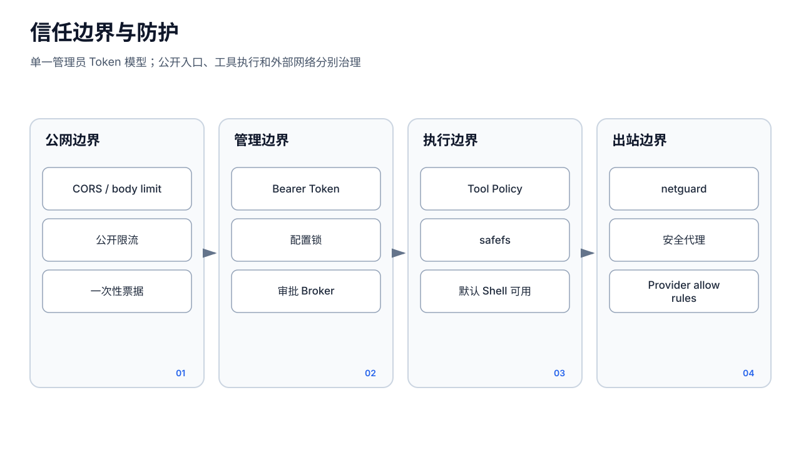

# 安全与信任边界




## 1. 威胁模型

当前目标环境是个人电脑或小型服务器上的单机自托管实例。主要风险：

- 未授权访问管理 API；
- Public/Telegram/飞书消息中的提示注入；
- Agent 使用文件、Shell、浏览器和消息工具越权；
- SSRF、DNS 重绑定和云元数据访问；
- 路径穿越、符号链接和任意文件下载；
- Secret 在配置、日志、API 和子进程环境中泄露；
- 高并发/长运行导致费用或资源耗尽；
- 更新包、安装脚本或发布身份被篡改。

不在当前承诺内：恶意租户之间的强隔离、同机 root 对抗、容器逃逸防护、集群级拜占庭安全。

## 2. HTTP 边界

### 2.1 管理 API

`/api` 管理组依次经过 config access guard 和 Bearer Token 中间件：

- token 为空时返回 503，fail closed；
- Authorization 使用常量时间比较；
- 新配置默认生成随机 Token；手工配置或旧配置若仍使用 `changeme`，启动时会警告且部署者必须更换；
- EventSource 无法带 header 的审批流先通过已鉴权 REST 获取短时一次性 stream ticket；
- 长期 token 不应放 URL query、普通日志或媒体链接。

配置读写 guard 用于协调配置访问，不能替代 auth。

### 2.2 管理鉴权外的端点

- `/api/version`、更新状态、`/healthz`、`/readyz`：只暴露必要状态；
- `/api/download`、媒体：靠服务端 Artifact 登记和短时一次性票据授权；
- `/pub/*`：Channel password + limiter + 最小工具；
- 飞书 callback：平台签名、时间窗、重放保护；
- Prometheus 实验指标：需审查是否泄露业务/成员信息。

“不使用管理员 token”不代表“无授权”；每个公开端点必须有独立、范围更小的凭据或只读最小信息设计。

## 3. 身份与所有权

关键所有权键：

- Worker：`{ownerID, sessionID}`；
- 后台 Process/ACP：`{agentID, sessionID, UUID}`；
- Bot：`{agentID, channelID}`；
- Cron Job：`job.AgentID`，API 工具用 ForAgent 版本检查；
- Session 文件：每 Agent 独立目录；
- Project：项目 ACL；
- Approval：`agentID + sessionID + tool input`。

仅有资源 ID 不足以授权。所有读取、取消、删除、重连都应同时验证 owner。遗留缺少 owner 的查找必须像 `GetUnique` 一样在歧义时拒绝。

## 4. 文件系统边界

`pkg/safefs` 提供 Resource ID 校验和 base confinement。所有 Agent、Session、Project、Skill、Artifact 路径应经过统一边界，不允许：

- 用户控制的绝对路径直接进入 `os.Open/Remove/WriteFile`；
- 仅用字符串前缀判断；
- 路径清理后仍跟随逃逸 symlink；
- 下载 API把任意 path 当授权；
- 归档恢复在 root 下直接解压未经校验的成员名。

Artifact ticket 是能力凭据：只授权已登记的具体文件、具体 endpoint、短时间/一次消费。它不应成为通用路径代理。

## 5. 外部内容与提示注入

信任顺序：

```text
服务端固定策略与代码
  > 管理员配置
  > Agent 身份/批准的技能
  > 用户当前请求
  > 联系人/群档案/网页/文件/工具结果/渠道消息
```

外部内容即使被注入 system prompt 的“当前联系人摘要”，仍应标记为资料。实验 PromptDef 的 XML 包装可提醒模型，但不是强边界。真正安全性来自：

- Public 禁止全部工具；
- 管理/渠道统一 global + agent Policy；
- Ask 人工审批；
- 工具内部路径、网络、owner 检查；
- Secret 最小注入；
- 审计和资源限额。

模型输出不能直接改变 Policy 或绕过 Registry handler。

## 6. 网络边界

`netguard` 应覆盖所有动态出站：

- `web_fetch`；
- Chromium 初始导航、子资源、WebSocket 和页面发起请求；
- Provider Stream、健康探测、Key 测试、启动检查；
- Embedding；
- 自定义 BaseURL 和重定向。

拒绝目标包括回环、RFC1918、链路本地、云元数据和危险 DNS 解析。Ollama 仅例外允许配置中精确指定的本机端点。

限制：

- 这是应用层校验，不是 eBPF/防火墙；
- 第三方 SDK 若自行解析或连接，必须显式接入；
- 代理配置可能改变最终目的地；
- 已打开网页中的动态请求也必须走安全代理，不能只校验首个 URL。

## 7. 工具与审批边界

Global Policy 是上限，Agent Policy 只能收紧；无效 policy 全拒绝。Ask 在 Broker 不可用时拒绝。审批时应认为输入可能由模型构造，审批人需检查：

- 目标路径/域名/收件人；
- 命令与参数；
- 是否包含 Secret；
- 是否重复执行；
- 当前 Agent/Session 是否合理。

批准不等于工具实现安全。每个 handler 仍必须验证输入和 owner；Audit 失败也不能被当作未执行。

## 8. Sandbox 的准确边界

默认 Shell/Process 在宿主机运行。实验 sandbox 只是弱加固：

- 临时 HOME 不阻止访问进程用户可读的其他绝对路径；
- rlimit/timeout 防部分失控，不隔离内核和文件系统；
- 进程组 kill 不保证已逃逸/外部服务副作用撤销；
- 无网络 namespace，命令仍可能访问公网；
- macOS/Linux 行为不同，其他平台降级。

所以：

- 不可信代码不应只靠该 sandbox；
- Stable 环境应以专用低权限 OS 用户运行；
- 高权限 runtime 工具应默认 Deny/Ask；
- 真正隔离需 Docker/远程 sandbox 或等价内核边界，目前未实现。

## 9. Secret 边界

Secret 包括管理员 token、Provider key、Bot token、Webhook secret、Channel password：

- 配置文件 0600；
- 支持 `$env` SecretRef，保存无关字段时保留引用；
- API 响应默认脱敏；
- 不把全部宿主环境自动传给工具、Skill、ACP 或未来 MCP；
- 子进程环境由 Agent Env 与受控白名单构造；
- 日志、Trace、ToolAudit 和错误消息应过滤 Authorization/key。

同用户 Shell 工具可读取该用户可访问的文件和环境，因此 Secret 文件权限无法抵御已授权的任意宿主命令。

## 10. 资源与费用边界

- Public 有 request/model/session/concurrency/SSE/message/run timeout 限制；
- Session Worker 同 key 单轮；
- Process/ACP 有并发、时长、输出和所有权；
- LLM Throttle 可全局固定或按 Provider 自适应；
- Budget 在 Runner 前检查，但多入口接线并非完全统一，Public 主要依赖 limiter；
- 浏览器和 BotPool 是共享资源，关闭时统一回收。

预算检查与实际账单非原子；并发请求可能同时通过检查。需要严格财务上限时必须在扣费 Store 中做保留/结算事务，而不仅是执行前读取。

## 11. 实验能力

`pkg/aiteam/`、SkillOpt、ACP、自修改等具有更大边界。环境 flag 默认 off 不等于代码完全隔离：

- 部分路由始终注册，由 handler 再 gate；
- sandbox 位于 aiteam 命名空间却影响核心 exec 路径；
- 实验 goroutine/data dir 是否创建需逐项检查；
- 实验数据迁移和兼容性不属于 Stable 保证。

对外文档必须明确“实验、默认关闭、非强隔离”，不能因测试存在就宣称生产安全。

## 12. 供应链边界

源码合并、构建、Release、安装和在线升级是同一信任链：

- 唯一允许提交身份和受保护 main；
- CI 测试/race/UI/embed/scripts；
- 候选绑定精确 main SHA；
- checksum、SBOM、Sigstore OIDC 签名、GitHub provenance；
- 四个原生平台安装/更新/回滚；
- Draft-first 通过后唯一公开。

发布安全详见 [发布架构](release-architecture.md)。
