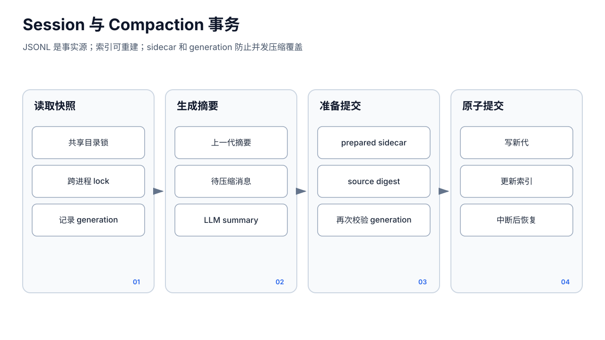

# 会话与上下文压缩




## 1. 会话文件模型

每个 Agent 有独立 `SessionDir`：

```text
sessions/
  sessions.json
  <sessionID>.jsonl
  <sessionID>.compaction.json   # 压缩进行中的 sidecar，成功后删除
  subagent/
    sessions.json
    <subagent-session>.jsonl
```

JSONL 第一行是 `SessionHeader`，后续为 `MessageEntry` 或 `CompactionEntry`。`sessions.json` 的 `SessionIndexEntry` 保存标题、来源、消息数、token estimate、时间等查询元数据。

关键原则：

- JSONL 是消息事实源；
- `sessions.json` 是派生索引，可由 JSONL 协调/重建；
- `sessionID` 先经过 `safefs.ValidateResourceID`，再 `ConfineToBase`；
- 同一规范化 Session 目录的多个 `Store` 实例共享进程内 mutex，并使用 `.store-transaction` 跨进程锁。

## 2. 写入与一致性

`AppendMessageWithTools` 在目录事务锁内：

1. 读取索引中的旧 metadata；
2. 追加一条 JSONL；
3. 更新 message count、last time、token estimate 和首条用户消息标题；
4. 原子保存索引。

如果 JSONL 追加成功而索引读取/更新失败，方法部分场景按 best-effort 返回，后续通过 JSONL 协调。该设计优先不丢消息，但不是 JSONL 与索引的单文件 ACID 事务。读取展示和 token 阈值可能在协调前短暂不一致。

工具调用记录附在 assistant 消息上，仅用于 UI 时间线；真正发回 LLM 的 tool_use/tool_result 块由 Runner history 管理。`ReadHistory` 会修补尾部孤立 tool_use，避免 Provider 因缺失 tool_result 拒绝请求。

## 3. Session ID 与来源

典型命名：

- 管理端：`ses-<毫秒>` 或客户端提供的有效 ID；
- Public Web：`web-<channelID>-<sanitizedToken>`；
- Telegram/飞书：渠道按 chat/thread 形成稳定 ID；
- Cron：`cron-<jobID>-<runID>`，每次全新；
- Subagent：任务 Session 位于 `subagent/` 子目录；
- Goal 等业务对象可使用专用前缀。

ID 前缀同时用于侧栏来源推断和数据隔离，但前缀不是授权本身。管理/公共重连还必须检查 Agent、Channel 和 Worker owner。

## 4. WorkerPool 的并发语义

`WorkerPool` 的键是 `{ownerID, sessionID}`，不是单独 `sessionID`：

- 管理端 owner 是 `agentID`；
- Public owner 是 `public/<agentID>/<channelID>`；
- 相同 session 字符串在不同 owner 下不会串流；
- 遗留只提供 sessionID 的回调使用 `GetUnique`，出现多个 owner 时 fail closed。

`SessionWorker.Enqueue` 使用 `reserved.Swap(true)`，同一 worker 在终态前第二个请求立即返回 busy；队列容量虽为 1，但不是排队多轮的消息队列。不同 key 可并行。

Worker 使用 `context.Background()` 执行 `RunFn`，因此浏览器断开不取消模型任务。30 分钟无保留任务后 worker 自删除；进程关闭调用 `StopAll`。这只是进程内并发控制，不是持久化队列，重启后未完成请求不会自动恢复。

## 5. Broadcaster 与 SSE 恢复

每个 Worker 有一个 `Broadcaster`：

- `StartGen()` 清空上一轮 buffer、增加 `genID`、重置 done；
- `Publish()` 先写内存 buffer，再非阻塞发送给 subscriber；
- 新 subscriber 复制当前 buffer 后接收实时事件；
- `done/error` 标记 generation 终止；
- 慢 subscriber channel 满时丢事件，不能阻塞 Runner。

这实现“连接级恢复”，不是耐久恢复：

- 同进程、同 Worker 存活时可重放当前轮；
- Worker 回收或服务重启后 buffer 消失；
- `genID` 没有进入对外事件，也没有每事件持久化单调序号；
- replay goroutine 与实时 channel 共享时，虽然订阅注册在快照锁内完成，但系统没有可跨进程校验的 Event offset。

消息最终状态应从 JSONL 查询；SSE 只负责实时体验。

## 6. 当前压缩实现：`pkg/session`

Runner 在下一轮开始调用 `maybeCompactSync`：

1. `EstimateTokens(sessionID)` 达到 `CompactionThreshold=50_000`；
2. 发 `compaction_start`；
3. 以 90 秒 context 调 `session.Compact`；
4. 发 `compaction_end`；
5. 成功后重新 `ReadHistory`，确保本轮模型使用压缩后的 history。

压缩保留最近 20 条消息（代码名 `keepTurns`，实际按 message 数量切分），较早消息交给 LLM 生成最多约 500 words 的摘要。

### 6.1 摘要代际

`compactionSnapshot` 记录当前文件 `{size, modUnixNano}` 作为 generation。生成摘要前读取上一代 `CompactionEntry.Summary`，并把它放入新摘要输入，所以连续压缩不会静默丢失最早上下文。

### 6.2 两阶段 sidecar

`<sessionID>.compaction.json` 状态：

- `summarizing`：已记录 generation 和边界，尚未得到摘要；
- `prepared`：摘要与新 token estimate 已持久化；
- 提交后：原子重写 JSONL 为 header + 新 CompactionEntry + 最近消息，再更新索引并删除 sidecar。

若进程在摘要完成后、提交前崩溃，下一次看到同 generation 的 `prepared` 可复用摘要，不重复付费调用 LLM。若 Session 在摘要期间变化，提交比较 generation 并返回 `ErrSessionChanged`，不覆盖新消息。

### 6.3 仍然存在的边界

- JSONL 替换与 `sessions.json` 更新是两个文件提交；两者之间崩溃时需依靠协调恢复；
- token estimate 是字符近似，不是 Provider tokenizer 精确值；
- 压缩失败只作为 `compaction_end` 错误文本上报，当前用户请求继续使用未压缩 history，可能随后碰到模型上下文上限；
- chatlog summary 更新是压缩提交后的附加动作，失败不回滚会话；
- sidecar `summarizing` 没有已生成摘要，崩溃后仍需重新调用 LLM。

## 7. 旧 `pkg/compaction`

仓库还保留 `pkg/compaction/compaction.go`：

- 以 `used/max > 75%` 判断；
- `Compactor.Compact` 直接把整个 history 交给模型；
- 通过 `Store.Append` 追加 CompactionEntry；
- 返回仅含 summary 的新 history；
- 没有当前 `pkg/session` 的 generation 检查、prepared sidecar、保留最近 20 条、原子重写和上一摘要合并。

当前 Runner 不导入或调用这个包；主路径是 `session.Compact`。因此 `pkg/compaction` 应视为旧兼容/遗留实现，不能用它的 75% 语义解释线上行为，也不应在新代码中继续接线。删除前需确认没有外部包依赖和兼容承诺。

## 8. 标题与清理

- 第一条用户消息产生初始标题；
- 消息数达到里程碑时 `MaybeAutoRetitle` 后台调用简单 LLM；
- 用户手动改名设置 `TitleOverridden=true`，自动标题不得覆盖；
- 每成员 `Reaper` 默认每 24 小时检查，清理超过保留期的会话；
- 内部 skill-studio/subagent session 在部分列表 API 中隐藏，但文件仍受各自存储与清理规则约束。

自动标题和 Reaper 都是辅助能力，不应影响消息事实源；任何失败最多造成索引体验退化，不应删除当前活跃会话。
