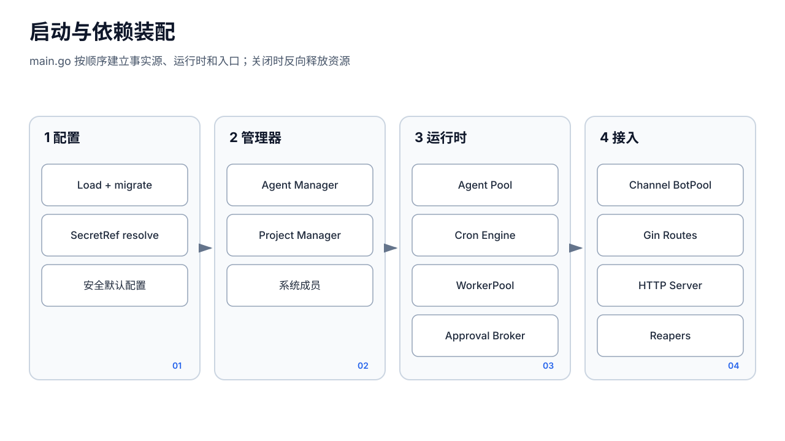

# 启动与依赖装配




## 1. 入口模式

`cmd/aipanel/main.go` 的 `main` 同时承载多种入口，顺序有语义：

1. 先识别更新守护进程内部命令；
2. 再把 `agent/cron/goal/...` 等业务 CLI 交给 `internal/agentcli`，避免被运维 help/flag 解析拦截；
3. 处理 `start/stop/restart/status/token` 等运维命令；
4. 其余情况进入长期运行的 HTTP 服务模式。

Agent CLI 是 REST API 的瘦客户端，不是第二套领域实现。服务模式才创建 Manager、Pool、Cron 和渠道 goroutine。

## 2. 服务启动顺序

### 2.1 配置与基础目录

1. `config.Load(configPath)` 读取并迁移配置；文件不存在时生成 `config.Default()` 并安全保存。
2. 将 `cfg.Agents.Dir` 归一为绝对路径。
3. `agent.NewManager(agentsDir).LoadAll()` 加载成员。
4. `project.NewManager("projects").LoadAll()` 加载共享项目。
5. 确保系统成员 `__config__` 存在。

配置加载失败和部分领域加载失败的处理不同：无配置可生成安全默认值；成员/项目加载错误通常记录 warning 后继续，这意味着健康状态和管理 UI 必须能暴露部分初始化问题，不能把“HTTP 已监听”视为全部数据有效。

### 2.2 执行核心

1. `agent.NewPool(cfg, mgr)` 创建执行装配器和惰性浏览器 Manager。
2. `pool.SetProjectManager(projectMgr)` 注入共享项目。
3. 创建 `subagent.Manager`，并通过 Pool 设置扩展 Run 函数。
4. 创建 SkillOpt Manager（实验/高级能力）。
5. 构造 Cron 的 `cronRunFunc`：每次使用 `cron-{jobID}-{runID}` 隔离会话。
6. `cron.NewEngine("cron", cronRunFunc, announceFunc)`，`Load()` 成功后 `Start()`。
7. `pool.SetCronEngine(cronEngine)`，使 Agent 的 cron 工具访问同一引擎。

Cron 在审批 Broker 前启动，但实际 heartbeat、渠道和请求执行必须在 Broker 注入后才创建 Runner；代码注释明确要求审批先于这些运行入口接线。

### 2.3 审批、后台执行与渠道

1. 创建审批审计日志和进程级 `tools.Broker`；
2. `api.SetApprovalBroker` 与 `pool.SetApprovalBroker` 注入同一 Broker；
3. `pool.StartHeartbeats()`；
4. 创建根 `context.WithCancel`；
5. 创建 `channel.BotPool`；
6. 向 Pool 注入 `send_message` sender；
7. 遍历成员级 channel 配置，启动 Telegram/飞书 Bot；
8. `session.NewWorkerPool()`；
9. 为每个已加载成员启动 `session.Reaper`；
10. `pool.SetWorkerPool(workerPool)`，供子成员向父会话广播。

这里的生命周期不是统一容器管理：BotPool、Reaper、Heartbeat、Cron、Browser、实验 payroll cron 分别持有自己的 goroutine/context。新增后台组件时必须明确启动失败、停止信号、等待退出和数据目录，而不能只在 `main` 中 `go` 启动。

### 2.4 计费、实验模块和 HTTP

1. 创建 `usage.Store` 并注入 Pool；
2. 创建 `budget.Store` 并注入 Pool；
3. 按环境开关装配 `pkg/aiteam/` 钱包、汇率、Guard、Judge、Payroll、Revenue 等；
4. 创建全局 LLM Throttle；
5. `api.RegisterRoutes(...)` 一次性传入主要依赖；
6. 计算监听地址，创建 `http.Server` 并 `ListenAndServe()`。

实验模块默认关闭，但当前并非所有实现都做到“关闭时完全不导入、不挂路由、不创建目录/对象”。例如 Router 中 aiteam 路由存在，由 handler 内再检查 flag。文档和 Stable 承诺必须以实际 gate 为准。

## 3. 依赖图与所有权

```text
Config ───────────┬─ Agent Manager
                  ├─ Pool ── Browser Manager
                  │   ├─ Project Manager
                  │   ├─ Cron Engine
                  │   ├─ Subagent Manager
                  │   ├─ Approval Broker
                  │   ├─ Usage/Budget
                  │   └─ per-run LLM/Registry/Runner
                  ├─ API handlers
                  └─ Channel bots

WorkerPool ───────┬─ 管理端 Chat
                  ├─ Public Chat
                  └─ 父会话子成员通知
```

`Pool` 持有共享依赖，但 Runner、LLM Client、Tool Registry 和 Session Store 通常按调用新建。这样减少跨会话可变状态共享，却造成管理端与 Pool 重复装配、能力漂移风险。

## 4. 配置的启动时与实时语义

并非所有配置保存后都能实时应用：

- 端口、bind、部分鉴权与进程级依赖在 HTTP Server/中间件构建时捕获，需要重启；
- Agent、成员渠道可通过 Manager/BotControl 热更新部分状态；
- Provider、模型、工具策略是否被下一次执行看到，取决于 handler/Pool 是否读取同一个已发布 `cfg` 快照；
- `config.Transaction` 保证磁盘提交成功后才覆盖内存，但不能自动重建已启动的 server、Bot 或全局 throttle。

API 应返回或 UI 应显示 `appliedLive` / `restartRequired` 的真实含义。持久化成功只表示新配置已成为重启基线，不表示所有运行中组件已重配。

## 5. 关闭顺序

收到 `SIGINT`/`SIGTERM` 后：

1. 取消根 context，停止渠道相关工作；
2. 停止 heartbeats；
3. 停止 BotPool；
4. `workerPool.StopAll()`；
5. `cronEngine.Stop()` 并等待；
6. `pool.CloseBrowser()`；
7. 以 10 秒超时调用 `srv.Shutdown`。

限制：

- `SessionWorker.Stop()` 关闭 worker 控制通道，但正在 `RunFn` 中使用的是 `context.Background()`；Stop 不直接取消当前 Runner。进程退出最终会终止它，优雅阶段不等于所有工具已补偿完成。
- 审批 Broker 是内存状态，关闭/重启不会恢复 pending。
- 实验模块若使用独立 `context.Background()`（例如 payroll cron）必须自行支持停止；否则不属于完整的统一关闭树。

## 6. 构建边界

完整二进制必须先构建 Vue，再同步 `ui/dist` 到 `cmd/aipanel/ui_dist`。直接 `go build` 只会嵌入仓库中已有的静态目录，可能得到过期 UI。开发/CI 的正确约束是：

```text
npm ci/test/build
  → 校验 ui/dist 与 cmd/aipanel/ui_dist 一致
  → CGO_ENABLED=0 go build
```

发布构建额外使用 `-trimpath`、固定版本 ldflags，并在候选验证中重建后逐字节 `cmp`。因此“后端编译成功”不是可发布构建完成的充分条件。
