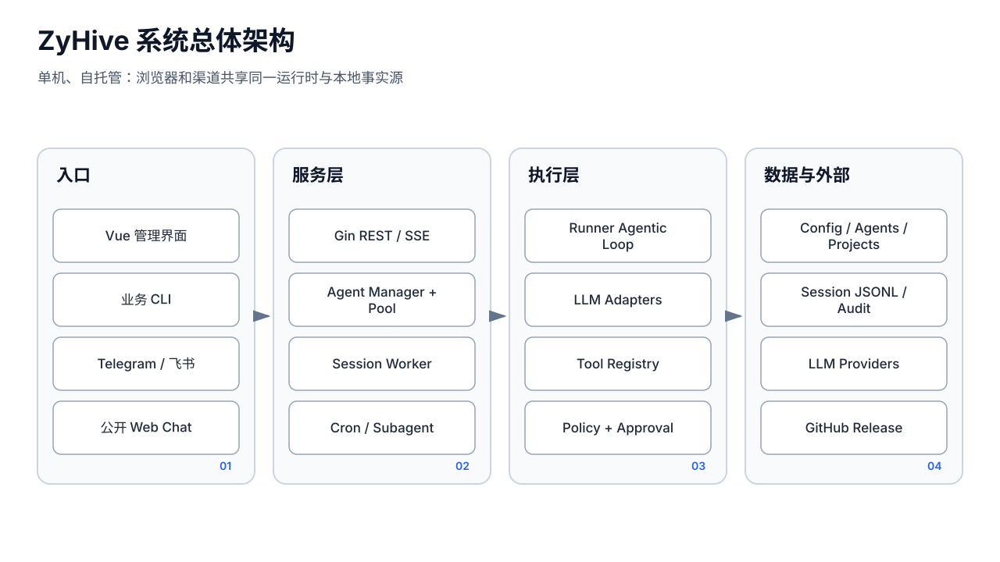

# 系统总览




## 1. 产品与部署边界

ZyHive 当前是单机、单进程、本地文件持久化的自托管 Beta：

- 后端：Go，入口 `cmd/aipanel/main.go`，Gin HTTP 服务；
- 前端：Vue 3，构建后复制到 `cmd/aipanel/ui_dist/`，由 `go:embed` 嵌入同一二进制；
- 状态：配置 JSON、会话 JSONL、Markdown 工作区、审计/用量 JSONL、Cron JSON；
- 外部依赖：LLM Provider、Telegram、飞书、Brave Search、可选 Chromium 和 ACP CLI；
- 运行模型：一次消息驱动一次 `runner.Runner`，Runner 内循环调用模型与工具，尚无独立的持久化 Run/Step/Checkpoint。

系统没有 PostgreSQL、Redis、消息队列或集群协调层。文件锁覆盖使用相同数据目录且遵守 `pkg/persist` 的 ZyHive 进程，但整体产品仍按单实例设计，不能由局部跨进程锁推导出高可用或完整多实例安全。

## 2. 逻辑分层

```text
交互入口
  Vue 管理端 / Public Web / Telegram / 飞书 / Agent CLI / Cron / Heartbeat
        │
传输与适配
  internal/api / pkg/channel / internal/agentcli / pkg/cron
        │
执行装配（当前多路径）
  internal/api/chat.go / internal/api/public_chat.go / pkg/agent.Pool
        │
Agent 运行
  pkg/runner + pkg/llm + pkg/tools
        │
领域能力
  session / memory / network / project / subagent / goal / browser
        │
本地持久化
  config JSON / session JSONL / Markdown / JSON(L) 审计与索引
```

“执行装配”不是单一服务：管理端聊天自行创建模型客户端、工具注册表和 Runner；Pool 又为渠道、Cron、Heartbeat、子成员创建另一套实例。这是理解行为差异和后续重构优先级的核心。

## 3. 核心组件与关键符号

### 3.1 进程与 API

- `main.main`：CLI 分流、配置加载、依赖装配、后台服务启动、HTTP 监听与优雅关闭。
- `api.RegisterRoutes`：集中注册管理 API、公共 API、健康检查、回调和 SPA。
- `agent.Manager`：成员定义、工作区、渠道和身份文件的生命周期。
- `project.Manager`：共享项目目录及成员权限。
- `agent.Pool`：按请求装配 Runner；持有浏览器、审批、Cron、项目、Subagent、Usage、Budget 等可选依赖。`runners` 字段不是当前每次执行复用 Runner 的主机制。

### 3.2 对话运行

- `runner.Config`：一次 Runner 所需的 Agent、模型、工具、会话、上下文、审计、预算和用量依赖。
- `runner.Runner`：保存本次加载的 history，执行模型—工具循环并发出 `RunEvent`。
- `llm.Client` / `llm.ChatRequest` / `llm.StreamEvent`：统一多 Provider 流式接口。
- `tools.Registry`：工具定义和 handler 集合；动态 `With*` 注册后由 `ConfigureGovernance` 收口。

### 3.3 会话与流

- `session.Store`：每成员一个会话目录，JSONL 是消息事实源，`sessions.json` 是可重建索引。
- `session.WorkerPool`：键为 `{ownerID, sessionID}`；同一键同时只允许一轮。
- `session.SessionWorker`：HTTP 断开后仍用 `context.Background()` 完成执行。
- `session.Broadcaster`：当前 generation 的内存回放缓冲和实时 fan-out。

### 3.4 自动化与协作

- `cron.Engine`：计划解析、任务注册、运行互斥、持久化 claim、隔离会话和结果通知。
- `subagent.Manager`：后台派遣任务；Pool 创建 `subagent/` 会话目录并可向父会话广播。
- `network.Store`：每成员的联系人、群档案、索引和摘要。
- `memory.MemoryTree` / `Consolidator`：四层 Markdown 记忆和 daily→core 蒸馏。

### 3.5 治理和持久化

- `tools.ToolPolicy`：Profile、Allow、Deny、Ask。
- `tools.Broker`：进程内审批 pending 表、SSE 事件和决策等待。
- `toolaudit.Log`：工具输入/结果审计；大结果可旁路 blob。
- `persist.LockFile` / `WithFileLock` / `AtomicWrite`：进程内互斥、相邻锁文件、临时文件同步与原子替换。
- `config.Transaction`：复制候选、持久化成功、再发布到内存。

## 4. 主要数据流

### 4.1 管理端消息

```text
POST /api/agents/:id/chat
  → 鉴权、解析成员/模型、GetOrCreate session
  → WorkerPool.GetOrCreate(agentID, sessionID)
  → Enqueue（同会话繁忙则拒绝）
  → chatHandler.execRunner 自行装配 Registry/Runner
  → Runner 读取 JSONL、压缩、调用 LLM/Tool、追加消息
  → Broadcaster 缓冲并广播 RunEvent
  → SSE；断线可按相同 owner/session 重连
```

### 4.2 渠道消息

```text
Telegram/飞书接收并验证/授权
  → 形成渠道 sessionID、下载媒体、补充联系人/群摘要
  → agent.Pool.RunStreamEvents
  → Pool 动态注册工具、应用治理、创建 Runner
  → channel.StreamEvent
  → 渠道适配器发送文本/卡片/文件
```

### 4.3 Cron

```text
robfig/cron 触发 occurrence
  → 同任务内存 activeRuns 检查
  → 按 jobID+occurrenceMs 创建持久化 claim
  → cron-{jobID}-{runID} 隔离 session
  → Pool.SubagentRunFunc 执行
  → 记录 run，更新 claim
  → delivery=announce 时主动发送；NO_ALERT 则静默
```

## 5. 数据所有权

- 全局配置：活动配置路径（通常 `aipanel.json` 或安装后的 `zyhive.json`）。
- Agent 根：`cfg.Agents.Dir/<agentID>/`。
- Agent 工作区：身份、灵魂、记忆、通讯录、技能和用户文件。
- Agent 会话：`Agent.SessionDir/*.jsonl` 与 `sessions.json`。
- 共享项目：进程工作目录下 `projects/`；不是 Agent 私有目录。
- Cron：进程工作目录下 `cron/`，含 job、runs 和 claims。
- Usage：`agentsDir/.usage/YYYY-MM.jsonl`。
- 审批与工具审计：位于 Agent 根相关审计目录。

部分目录由相对当前工作目录推导，部署时工作目录和配置中绝对/相对路径会影响实际位置；这也是备份必须覆盖配置、Agent、Project、Cron 等全部状态而不能只备份工作区的原因。

## 6. 并发和事务模型

- 管理聊天以 Worker 键串行化同一会话，但不同成员/会话可并行。
- Runner 当前把同一模型回复中的所有 tool calls 并行执行，再按原始顺序组装结果；代码没有依据工具副作用或并行安全元数据分组。
- Broadcaster 不阻塞 Runner：订阅者 channel 满时丢实时事件；重连回放只在内存中，进程重启后不存在。
- Store 使用目录级共享互斥与 `.store-transaction.lock`；JSONL 先追加，索引后更新，索引失败时可通过扫描 JSONL 重建/协调。
- 配置和多数快照用“临时文件写入→fsync→rename→目录 fsync”提交。
- Cron claim 降低同一 occurrence 重复执行，但崩溃窗口用 `uncertain` 暴露而不是冒险重放。

## 7. 明确不具备的能力

- 不具备跨重启恢复到模型调用或工具调用中间步骤的 Run Engine；
- 不保证非幂等工具 exactly-once；
- 不提供持久化审批等待；Broker 重启后 pending 消失；
- 不提供强宿主机命令隔离；
- 不提供多租户数据隔离、RBAC、SSO 或集群一致性；
- 自定义 SSE 不是 AG-UI，内置工具也不是 MCP 工具网关；
- 日志、Usage、ToolAudit 尚未统一成完整 Trace。
