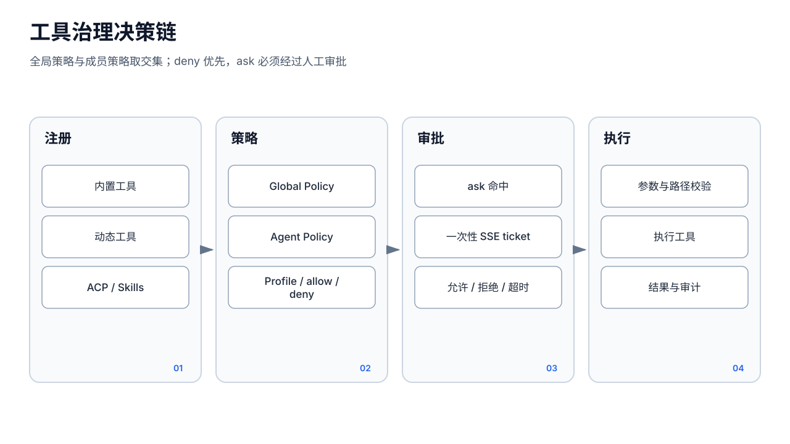

# 工具、策略与审批




## 1. Registry 生命周期

`tools.Registry` 同时保存给模型的 `[]llm.ToolDef` 和服务端 `map[name]Handler`。典型生命周期：

1. `tools.New(workspaceDir, agentsRoot, agentID)` 注册核心文件/执行工具；
2. 通过 `WithProjectAccess`、`WithCronEngine`、`WithSessionTools`、`WithBrowser`、`WithWebSearch`、`WithFileSender`、`WithSubagentManager` 等按依赖动态扩展；
3. 设置 `sessionID`、环境和所有者；
4. 最后调用 `ConfigureGovernance(globalRaw, agentRaw, broker, timeout)`；
5. 将 Registry 交给 Runner。

策略必须在动态注册完成后收口。Registry 对治理后再注册的工具也会根据已保存 policy layer 拒绝越权注册，但 Ask 集合和能力审计仍应通过统一 finalization 管理。

## 2. 工具类别

主要 group：

- `group:fs`：read/write/edit/grep/glob；
- `group:runtime`：exec/process/ACP；
- `group:web`：web_fetch/web_search；
- `group:memory`：memory_search；
- `group:ui`：浏览器、图片；
- `group:agent`：成员列表、派遣、任务、回报；
- `group:sessions`：跨会话读取、发送、改名；
- `group:cron`：定时任务；
- `group:messaging`：消息和文件发送；
- `group:self`：技能、身份、环境、愿望的自修改；
- `group:project`：共享项目；
- `group:network`：联系人/群档案笔记。

工具数量和可用性是动态的：缺少 API Key、浏览器、Channel、Project Manager、Cron Engine 或 ACP 配置时，相应工具不会注册。模型应以当前 Definitions/Capabilities 为准，而不是 README 固定清单。

## 3. Policy 解析与组合

`ToolPolicy`：

```json
{
  "profile": "coding",
  "allow": ["web_search"],
  "deny": ["exec"],
  "ask": ["group:messaging"]
}
```

Profile：

- `full`：默认不限制；
- `coding`：文件、运行时、Agent、Memory 和有限 Web/Image；
- `messaging`：消息、Session、Memory；
- `minimal`：`send_message`、`memory_search`。

决策规则：

1. 每个 layer 单独计算 Profile 基线；
2. `allow` 可在该 layer 内扩展；
3. `deny` 永远获胜；
4. 工具必须被全局层和成员层都允许；
5. 成员层不能扩大被全局层禁止的能力；
6. 两层 `ask` 取并集。

无效 JSON、未知字段、未知 Profile 或未知 group 使 `ConfigureGovernance` fail closed：Registry 应用 `Deny:["*"]` 并移除审批 Broker，而不是静默回到 full。

## 4. Public Chat 的最小能力

Public Web 使用 `newPublicToolRegistry`：

1. 先 `tools.New`；
2. 设置 session；
3. 立即 `ApplyPolicy(Deny:["*"])`；
4. Runner 的 `SupportsTools=false`。

因此公开访客可以调用模型，但不能执行宿主机、文件、项目、技能、消息或自修改工具。这是独立于成员自身 ToolPolicy 的强收紧；不应为了“与管理端一致”而移除。

## 5. Ask 审批状态机

`Registry.Execute` 命中 Ask 时：

```text
Execute
  → Broker.Request 创建 apv_* 请求
  → pending map + approval_request SSE
  → 阻塞等待
      ├─ Decide(approve) → 执行 handler
      ├─ Decide(deny)    → 不执行，返回可供模型继续处理的拒绝文本
      ├─ timeout         → 自动拒绝
      └─ ctx cancelled   → 自动拒绝并返回 context error
```

`ApprovalRequest` 包含 Agent、Session、工具名、输入、创建与过期时间。默认超时 5 分钟。Broker 缺失时返回 `ErrApprovalUnavailable`，必须 fail closed。

Broker 是进程级内存单例：

- pending 不持久化；
- 服务重启后等待中的 Runner 和审批都不能恢复；
- SSE subscriber 满时事件可丢，但客户端重连应通过 Pending snapshot 补拉；
- `Decide` 与 timeout 使用 `claimPending` 保证一个请求只有一方取得决策权；
- 审批允许只授权这一次具体调用，不修改长期 Policy。

审批是执行前门禁，不提供工具执行后的回滚。批准非幂等动作前 UI 应展示完整工具名、关键参数、Agent 和 Session。

## 6. 审计

两类记录不能混为一谈：

- Approval audit：approved/denied/expired/cancelled 的决策；
- Tool audit：实际工具调用的完整输入、输出、耗时、错误和关联 ID。

Runner 在工具 goroutine 完成后写 `toolaudit.Entry`。大结果可能写 blob，主 JSONL 留引用。若审计写失败，当前实现通常记录错误但不会回滚已经执行的工具；因此审计是可追溯层，不是 exactly-once 事务日志。

## 7. 文件与项目边界

核心文件工具通过 Registry 的路径解析和 `safefs` 将相对路径限制在 Agent 工作区；共享项目工具走 `project.Manager` 的独立授权。必须防范：

- `..` 路径穿越；
- 绝对路径；
- 符号链接逃逸；
- 字符串前缀误判（如 `/base/a` 与 `/base/ab`）；
- TOCTOU：校验后路径被替换。

下载/媒体不接受任意客户端绝对路径，而是由服务端登记 Artifact 并签发短时一次性票据。`send_file` 的可发送范围同样不能绕过工作区/Artifact 边界。

## 8. Exec、Process 与实验 sandbox

默认 `exec` 可直接在宿主机以 ZyHive 进程权限运行 Bash。Process/ACP 已有：

- `{agentID, sessionID, UUID}` 所有权；
- 并发、运行时间和输出限制；
- 进程组取消与回收；
- 工作目录/环境约束。

`ZYHIVE_EXPERIMENTAL_SANDBOX=1` 会把 `exec` 转给 `pkg/aiteam/sandbox.Run`，增加：

- 临时 HOME/TMP；
- Linux/macOS 进程组；
- wall-clock 超时；
- 输出截断；
- 部分 rlimit 和终止子进程。

它明确不是强隔离：

- 无容器、chroot、user/mount/network namespace；
- 无文件系统 allowlist 的内核强制；
- 无出站网络防火墙；
- 仍以宿主进程用户权限运行；
- 非 Unix 平台进一步降级。

因此“sandbox enabled”只能解释为弱加固，不能把不可信代码视为安全。高风险执行仍需 Policy Deny/Ask、低权限系统用户和外部容器隔离。

## 9. 网络工具

`web_fetch`、Chromium 全部 HTTP/HTTPS/WebSocket 流量、模型动态 BaseURL、健康探测和 Embedding 地址接入 `netguard`：

- 拒绝回环、私网、链路本地、云元数据；
- 检查 DNS 解析和重定向；
- Ollama 只允许显式配置的精确本机端点。

网络防护是请求时判断，不能替代宿主机防火墙；DNS、代理和第三方客户端升级都需要回归测试。

## 10. 当前并发限制

Policy 模型只表达 allow/deny/ask，不表达：

- 只读或副作用；
- 幂等性；
- 并行安全；
- 可重试性；
- 资源冲突键。

Runner 会并行执行同批所有工具。要获得可靠事务语义，需要先为工具增加元数据，再由 ToolStep 执行器按冲突和副作用调度；仅在文档中要求模型“按顺序调用”不是安全保证。
