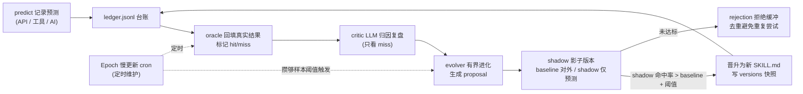

# SkillOpt 设计文档：让 ZyHive 的 skill 自我进化

> 分支：`feat/skillopt` · 状态：设计待确认 → 实施
> 目标：把「预测台账 → 结果回填 → 自动归因 → 有界进化 → 影子 A/B → 慢更新」这套自进化闭环，作为 ZyHive 内建能力植入源码，让任意静态 skill 升级为可自我进化的 skill。

---

## 1. 背景与目标

ZyHive 现有 skill 系统是**静态**的：

- 落盘：`{agent.WorkspaceDir}/skills/{skillId}/`，包含 `skill.json`（`skill.Meta`）+ `SKILL.md`（注入提示词的正文）。
- 逻辑：`pkg/skill/{skill,loader,index}.go` 只负责扫描 / 读写 / 启停 / 生成 `INDEX.md`。
- API：`internal/api/skills.go`（全局 registry，写 `aipanel.json`）与 `internal/api/agent_skills.go`（per-agent 增删改查）。
- 前端：`ui/src/views/SkillsView.vue` + `ui/src/components/SkillStudio.vue`。
- 注入：`pkg/runner/system_prompt.go` **只注入 `skills/INDEX.md`** 这个轻量摘要，完整 `SKILL.md` 由 AI 按需用 read 工具读取。

SkillOpt 的目标：让每个 skill 都能用**真实世界结果**作为 Oracle（如世界杯比分、交易盈亏、任务是否达成），自动复盘自己的预测、生成归因教训，并在四重保护下有界进化自己的 `SKILL.md`。

设计原则（用户已确认「改源码内核」+「全套」）：

1. **全新增、零破坏**：新增 `pkg/skillopt` 包、新 API group、前端新 tab，不改 skill 现有读写路径，向后兼容。
2. **沿用既有范式**：JSONL 台账（仿 `cron`/`goal`）、callLLM 依赖注入（仿 `memory.Consolidate`）、cron 定时（仿 memory 自动整理）、AI 定期评审（仿 `goal` checks）、提案审批（仿世界杯 `skill-workshop`）。
3. **进化有界、可回滚**：有界编辑 + 版本快照 + 拒绝缓冲 + 影子 A/B，四重保护，任意进化一键 rollback。

---

## 2. 现状关键事实（已核实）

| 关注点 | 事实 | 来源 |
|--------|------|------|
| skill 落盘 | `{WorkspaceDir}/skills/{skillId}/skill.json` + `SKILL.md` | `pkg/skill/skill.go` |
| Meta 字段 | `ID/Name/Version/Icon/Category/Description/Enabled/InstalledAt/Source` | `pkg/skill/skill.go:14` |
| 提示词注入 | 仅注入 `skills/INDEX.md`；完整 SKILL.md 按需读取 | `pkg/runner/system_prompt.go:144` |
| 路由惯例 | `internal/api/{domain}.go` + `pkg/{domain}/` + `router.go` 里 `v1.Group` / `agents.Group` 注册 | `internal/api/router.go` |
| LLM 调用 | `llm.NewClient(provider,baseURL).Stream(ctx, &llm.ChatRequest{...})`，业务层用 `callLLM func(ctx,system,user)(string,error)` **依赖注入** | `pkg/agent/pool.go:804`、`pkg/memory/consolidator.go:36` |
| 模型解析 | `pool.resolveModel(ag)` + `config.ResolveCredentials(modelEntry, providers)` | `pkg/agent/pool.go:749` |
| cron 定时 | `cron.Engine`（`Add/Remove/RunNow`），job 用 `Payload.Kind=agentTurn` + `Delivery.Mode=none` 隔离静默；`SilentToken="NO_ALERT"` | `pkg/cron/engine.go` |
| **cron 哨兵拦截层** | cron 的 `runJob` 在 `cmd/aipanel/main.go:259 cronRunFunc` 里走 `pool.SubagentRunFunc()`；`__MEMORY_CONSOLIDATE__` 只在 `pool.Run`（line 871）拦截，**不经过 cronRunFunc**。故 SkillOpt 的定时哨兵必须在 `cronRunFunc` 里显式拦截 | `cmd/aipanel/main.go`、`pkg/agent/pool.go` |
| Agent 访问 | `mgr.Get(id) (*Agent, bool)`；`ag.WorkspaceDir / ag.SessionDir / ag.Name / ag.ID` | `pkg/agent/manager.go:165` |
| JSONL 范式 | `O_APPEND|O_CREATE|O_WRONLY` 追加 + `bufio.Scanner`（1MB buffer）读取，保留尾部 N 条 | `pkg/cron/engine.go:547`、`pkg/goal/manager.go:457` |
| 前端 api 客户端 | `ui/src/api/index.ts`（axios 实例，自动带 token） | `ui/src/api/index.ts` |

> ⚠️ **关键决策**：因 cron 哨兵不经过 `cronRunFunc`，SkillOpt 不复用 `pool.Run` 的哨兵机制，而是在 `cronRunFunc` 入口显式判断哨兵前缀并直接调用 `skilloptManager.RunMaintenance(...)`（不跑 LLM agent turn，纯后台维护）。

---

## 3. 闭环设计



**闭环时序（一次完整进化）**：

1. AI/用户通过 API 或 `skillopt_predict` 工具记录一条预测 → append 到 `ledger.jsonl`（`hit=null`）。
2. 真实结果出来后，通过 API 或 `skillopt_oracle` 工具回填 → oracle 标记该条 `hit=true/false`。
3. cron 定时维护（或手动 `evolve`）：oracle 扫描待回填项 → epoch 检查样本数。
4. 攒够 `sampleThreshold` 条**已回填**样本：critic 对其中的 **miss** 样本调 LLM 生成归因标签 + 教训。
5. evolver 基于教训对 `SKILL.md` 的**规则区/教训区**做**有界编辑**，生成 proposal（含 diff、归因依据、状态 pending）。
6. proposal 被接受（手动或自动）→ 进入 shadow 模式：当前 baseline 继续对外，shadow 版本仅参与预测打分。
7. 攒够 shadow 样本后：若 shadow 命中率 > baseline 命中率 + `promoteMargin` → promote（shadow 成为新 baseline，写 `versions/v{n}-SKILL.md` 快照，`epoch++`）；否则该 proposal 进 rejection 缓冲（指纹去重）。

---

## 4. 数据模型（落盘 `skills/{skillId}/skillopt/`，per-agent per-skill 隔离）

```
skills/{skillId}/skillopt/
├── ledger.jsonl              # 每条预测一行（见 LedgerEntry）
├── epoch.json                # 进化状态机（见 EpochState）
├── versions/
│   ├── v1-SKILL.md           # 每个 epoch 的 SKILL.md 快照（回滚 + A/B 来源）
│   └── v2-SKILL.md
├── proposals/
│   └── {proposalId}.json     # 进化提案（见 Proposal）
└── lessons.md                # 聚合教训（供 system_prompt 注入，置顶展示）
```

### 4.1 `LedgerEntry`（`ledger.jsonl` 每行）

```go
type LedgerEntry struct {
    ID             string   `json:"id"`
    TS             int64    `json:"ts"`                       // 预测时间 UnixMilli
    SessionRef     string   `json:"sessionRef,omitempty"`    // 来源会话
    ContextDigest  string   `json:"contextDigest,omitempty"` // 预测时的关键上下文摘要
    Prediction     string   `json:"prediction"`              // 预测内容
    Oracle         string   `json:"oracle,omitempty"`        // 回填的真实结果
    Hit            *bool    `json:"hit,omitempty"`           // nil=未回填, true/false
    OracleTS       int64    `json:"oracleTs,omitempty"`      // 回填时间
    AttributionTags []string `json:"attributionTags,omitempty"` // critic 归因标签
    Lesson         string   `json:"lesson,omitempty"`        // critic 教训（仅 miss）
    Version        int      `json:"version"`                 // 预测时生效的 epoch 版本
    Shadow         bool     `json:"shadow,omitempty"`        // 是否影子版本的预测
}
```

### 4.2 `EpochState`（`epoch.json`）

```go
type EpochState struct {
    CurrentEpoch    int     `json:"currentEpoch"`
    BaselineVersion int     `json:"baselineVersion"`
    ShadowVersion   int     `json:"shadowVersion,omitempty"`   // 0=无影子
    SampleCount     int     `json:"sampleCount"`               // 自上次进化以来已回填样本数
    SampleThreshold int     `json:"sampleThreshold"`           // 触发进化阈值（默认 20）
    PromoteMargin   float64 `json:"promoteMargin"`             // shadow 晋升所需命中率优势（默认 0.05）
    ShadowMinSample int     `json:"shadowMinSample"`           // shadow 晋升所需最小样本（默认 10）
    HitRateBaseline float64 `json:"hitRateBaseline"`
    HitRateShadow   float64 `json:"hitRateShadow"`
    LastEvolvedAt   int64   `json:"lastEvolvedAt,omitempty"`
    RejectionBuffer []string `json:"rejectionBuffer,omitempty"` // 被拒提案指纹（去重）
    ActiveProposal  string  `json:"activeProposal,omitempty"`  // 当前 shadow 来源 proposal id
}
```

### 4.3 `Proposal`（`proposals/{id}.json`）

```go
type Proposal struct {
    ID           string   `json:"id"`
    CreatedAt    int64    `json:"createdAt"`
    Status       string   `json:"status"`        // pending | accepted | rejected | promoted
    FromVersion  int      `json:"fromVersion"`
    Rationale    string   `json:"rationale"`     // 归因依据（来自 critic）
    Lessons      []string `json:"lessons"`       // 本次进化采纳的教训
    DiffSummary  string   `json:"diffSummary"`   // 有界 diff 摘要
    NewContent   string   `json:"newContent"`    // 进化后的完整 SKILL.md（落 shadow 版本时写快照）
    Fingerprint  string   `json:"fingerprint"`   // 内容指纹（rejection 去重）
    HitRateBefore float64 `json:"hitRateBefore"`
    HitRateAfter  float64 `json:"hitRateAfter,omitempty"` // shadow 实测
}
```

### 4.4 `skill.Meta` 扩展（向后兼容，全部 `omitempty`）

```go
// pkg/skill/skill.go — Meta 追加 3 字段（展示用）
Evolving bool    `json:"evolving,omitempty"`
Epoch    int     `json:"epoch,omitempty"`
HitRate  float64 `json:"hitRate,omitempty"`
```

### 4.5 SKILL.md 有界编辑区约定

evolver 只允许改写 `SKILL.md` 中两个带标记的受控区，其余正文一字不动：

```markdown
<!-- skillopt:rules:start -->
（规则区：可被 evolver 增改的策略规则）
<!-- skillopt:rules:end -->

<!-- skillopt:lessons:start -->
（教训区：critic 归因教训自动累积，置顶展示）
<!-- skillopt:lessons:end -->
```

若 SKILL.md 不含标记区：evolver 首次进化时在文末**追加**这两个区（不动原文），实现渐进式接管。

---

## 5. 后端 `pkg/skillopt/`（全套）

所有需要 LLM 的函数都接受 `CallLLM func(ctx, system, user) (string, error)` 参数（依赖注入，仿 `memory.Consolidate`），保持包**零外部依赖**（仅 stdlib + uuid），便于表驱动单测。

| 文件 | 职责 | 关键导出 |
|------|------|---------|
| `store.go` | skillopt 目录路径解析 + 读写底座 | `Store`（封装 `workspaceDir, skillID`）、`NewStore`、`Dir()`、`ReadEpoch/WriteEpoch`、`ReadSkillMD/WriteSkillMD`、版本快照读写 |
| `types.go` | `LedgerEntry / EpochState / Proposal` + 默认常量 | `DefaultEpoch()` |
| `ledger.go` | 预测 append / query + 命中率统计 | `Append`、`Query`、`Backfill`、`HitRate(shadow bool)`、`PendingOracle()` |
| `oracle.go` | 结果回填，标记 hit/miss | `(s *Store) Oracle(entryID, result string, hit bool)` |
| `critic.go` | 对 miss 样本调 LLM 生成归因标签 + 教训 | `Critique(ctx, entries, callLLM) ([]Attribution, error)` |
| `evolver.go` | **有界编辑** SKILL.md 受控区，生成 proposal（不全量重写） | `Evolve(ctx, store, attributions, callLLM) (*Proposal, error)`、`applyBoundedEdit` |
| `epoch.go` | **Epoch 慢更新**：攒够阈值才触发一次 evolve | `MaybeEvolve(ctx, store, callLLM) (*Proposal, error)` |
| `shadow.go` | **影子 A/B**：accept→建 shadow；命中率超基线才 promote | `AcceptProposal`、`EvaluateShadow`、`Promote`、`Rollback(version)` |
| `rejection.go` | **拒绝缓冲区**：未达标提案入缓冲，指纹去重 | `Reject(proposal)`、`IsRejected(fingerprint)` |
| `manager.go` | 编排层：跨 agent 维护入口（被 cron / API / 工具调用） | `Manager`、`RunMaintenance(ctx, workspaceDir)`（遍历该 agent 所有 evolving skill）、`Overview` |

### 5.1 有界编辑安全约束（evolver）

- **只动标记区**：用正则定位 `<!-- skillopt:rules:start -->...end` 与 `lessons` 区，替换区内内容；区外内容按字节比对必须不变（变了则拒绝该提案）。
- **行数上限**：单次进化规则区净增 ≤ `maxRuleLines`（默认 8 行），教训区 ≤ `maxLessonLines`（默认 12 行），防止 LLM 失控全量重写。
- **指纹去重**：`Fingerprint = sha256(rules区+lessons区)`；命中 rejection 缓冲则跳过，避免反复尝试同一改动。

---

## 6. API `internal/api/skillopt.go`

挂在 `agents` group 下（复用 `authMiddleware`），路径前缀 `/api/agents/:id/skills/:skillId/skillopt`：

| 方法 | 路径 | 说明 |
|------|------|------|
| GET | `/skillopt` | 状态总览（epoch、baseline/shadow 命中率、样本进度、是否 evolving） |
| POST | `/skillopt/predict` | 记录一条预测 → append ledger |
| POST | `/skillopt/oracle` | 回填真实结果，标记 hit/miss |
| GET | `/skillopt/ledger` | 台账列表 + 命中率曲线数据（尾部 N 条） |
| POST | `/skillopt/evolve` | 手动触发一次进化（绕过样本阈值） |
| GET | `/skillopt/proposals` | 提案列表 |
| POST | `/skillopt/proposals/:pid/accept` | 接受提案 → 进入 shadow |
| POST | `/skillopt/proposals/:pid/reject` | 拒绝提案 → 入 rejection 缓冲 |
| GET | `/skillopt/versions` | 版本快照列表 |
| POST | `/skillopt/versions/:v/rollback` | 回滚到指定版本快照 |
| POST | `/skillopt/shadow/promote` | 手动晋升当前影子版本 |
| PUT | `/skillopt/config` | 开关 evolving + 调阈值（写 epoch.json + 管理 cron job） |

Handler 持有 `*agent.Manager`，每次 `mgr.Get(:id)` → `ag.WorkspaceDir` → `skillopt.NewStore(ag.WorkspaceDir, :skillId)`。需要 LLM 的 `evolve` 通过注入的 `callLLM`（由 pool 提供，见 §7.2）。

---

## 7. 集成点

### 7.1 cron 定时维护（仿 memory 自动整理）

- 开启 evolving 时（`PUT /skillopt/config`），创建 cron job：`Payload.Kind=agentTurn`、`Payload.Message="__SKILLOPT_MAINTAIN__:{skillId}"`、`Delivery.Mode=none`、`AgentID=ag.ID`、默认每天一次。
- **在 `cmd/aipanel/main.go` 的 `cronRunFunc` 入口**新增哨兵判断：消息以 `__SKILLOPT_MAINTAIN__:` 开头 → 解析 skillId → 调 `skilloptMgr.RunMaintenance(ctx, ag.WorkspaceDir, skillId)`（执行 oracle 巡检 + epoch 检查 + 到阈值自动 evolve + shadow 评估），返回简报字符串；不跑 LLM agent turn。
- 维护过程中需要 LLM（critic/evolver）：`skilloptMgr` 持有 `pool` 提供的 `callLLMForAgent(ctx, agentID, system, user)`（内部 resolveModel + ResolveCredentials + Stream，完全复刻 `ConsolidateMemory`）。

### 7.2 LLM caller 装配（pool）

在 `pkg/agent/pool.go` 新增导出方法：

```go
// CallLLMOnce 用 agent 的默认模型做一次性 system+user 调用（无工具、无历史），供 skillopt critic/evolver 复用。
func (p *Pool) CallLLMOnce(ctx context.Context, agentID, system, user string) (string, error)
```

实现复刻 `ConsolidateMemory` 的 callLLM 内联块。`skilloptMgr` 在 main.go 装配时注入 `pool.CallLLMOnce`。

### 7.3 runner 提示词注入（仿世界杯「核心错误教训」置顶）

`pkg/runner/system_prompt.go` 在注入 `skills/INDEX.md` 之后，新增注入聚合教训：

```go
// 注入各 evolving skill 的近期归因教训（置顶，强提醒）
injectFile(filepath.Join(workspaceDir, "skills", "INDEX.md"), "skills/INDEX.md")
// SkillOpt：把进化型 skill 的近期教训置顶（每个 skill 的 skillopt/lessons.md 由 evolver 维护，
// 这里读取聚合文件 skills/SKILLOPT_LESSONS.md，由 RunMaintenance 重建）
injectFile(filepath.Join(workspaceDir, "skills", "SKILLOPT_LESSONS.md"), "skills/SKILLOPT_LESSONS.md（近期进化教训）")
```

`RunMaintenance` 每次跑完重建 `skills/SKILLOPT_LESSONS.md`（聚合所有 evolving skill 的 lessons 区 + 当前命中率），轻量、可截断。

### 7.4 可选工具（仿 `wish_add` / `network_note`）

在 `pkg/tools` 新增 `skillopt_predict` / `skillopt_oracle`（`registry.go` 加 `WithSkillOpt(...)`，pool 在 `configureToolRegistry` 注册），让 AI 在对话中自行记录预测与回填。MVP 可先只做 API + cron，工具作为 §7.4 增量（实现时若时间允许一并完成）。

---

## 8. 前端

`ui/src/components/SkillStudio.vue` 增「🧬 进化」tab（该组件已 1315 行、本身是 skill 编辑器，最贴合）：

- **状态卡**：epoch、baseline/shadow 命中率、样本进度条、evolving 开关 + 阈值设置。
- **台账表**：ledger 列表（预测 / 结果 / hit 标记 / 归因标签），命中率折线（轻量 SVG 或纯 CSS bar，避免引第三方图表库）。
- **提案区**：proposal 列表 + diff 预览 + 接受 / 拒绝按钮。
- **版本区**：versions 快照列表 + 一键 rollback；baseline vs shadow A/B 命中率对比。

`ui/src/api/index.ts` 增 `skillopt*` 一组函数（沿用 axios 实例）。若体量过大则拆 `ui/src/views/SkillOptView.vue`（参考 `GoalsView.vue` / `UsageView.vue`）。

---

## 9. 交付流程与里程碑

1. ✅ clone `Zyling-ai/ZyHive` → `/Users/Zhuanz/Desktop/OpenClaw/ZyHive`（纳入 OpenClaw 工作区管理），建分支 `feat/skillopt`（本地开发，暂不 push）。
2. ✅ 精读 `pkg/skill` / `pkg/runner/system_prompt.go` / `pkg/cron/engine.go` / `pkg/agent/pool.go` / `pkg/memory/consolidator.go` / `pkg/goal`，定稿数据模型与接线点。
3. ✅ 本设计文档。
4. ⏭ 后端 `pkg/skillopt`（store/types/ledger/oracle/critic/evolver/epoch/shadow/rejection/manager）。
5. ⏭ API `internal/api/skillopt.go` + `router.go` 注册。
6. ⏭ 集成：`pool.CallLLMOnce` + `main.go` cronRunFunc 哨兵 + `system_prompt.go` 教训注入 + `skill.Meta` 扩展 +（可选）skillopt 工具。
7. ⏭ 前端 SkillStudio 进化 tab + api 客户端。
8. ⏭ Go 单测（ledger/oracle/critic/evolver/epoch/shadow/rejection 表驱动）+ `make build` 全量验证。

---

## 10. 风险与回滚

- **零破坏**：全部新增（新包 + 新 API group + 前端新 tab + 新增 Meta omitempty 字段 + 在 cronRunFunc/​system_prompt 各加一段判断）。不改 skill 现有读写路径。
- **进化四重保护**：有界编辑（只动标记区 + 行数上限）+ 版本快照（`versions/`）+ 拒绝缓冲（指纹去重）+ 影子 A/B（命中率超基线才上线）。任意进化可一键 `rollback` 到历史版本。
- **构建约束**：必须用 `make build`（vite build + sync-ui + go build；后端 `go:embed ui_dist`），不能直接 `go build`。
- **许可与推送**：AGPL 自有项目；当前 gh 账号可能非 `Zyling-ai` 成员，**默认仅本地开发**，是否 push/PR 由用户决定。

---

## 11. 测试与构建

- **Go 单测**：`pkg/skillopt/*_test.go` 表驱动，覆盖：
  - ledger append/query/命中率统计；
  - oracle 回填正确标记 hit/miss；
  - evolver 有界编辑——区外内容不变、超行数拒绝、指纹去重；
  - epoch 达阈值才触发；
  - shadow 命中率不达标不晋升 / 达标晋升 + 版本快照；
  - rejection 去重。
  - critic/evolver 用 fake `callLLM` 注入，确定性断言。
- **构建**：`make build` 全量（前端 vite build + sync-ui + 后端 go build），验证前后端打通、`go:embed` 不报错。
- **冒烟**：`internal/api/router_smoke_test.go` 既有范式 → 加 skillopt 路由注册冒烟。
