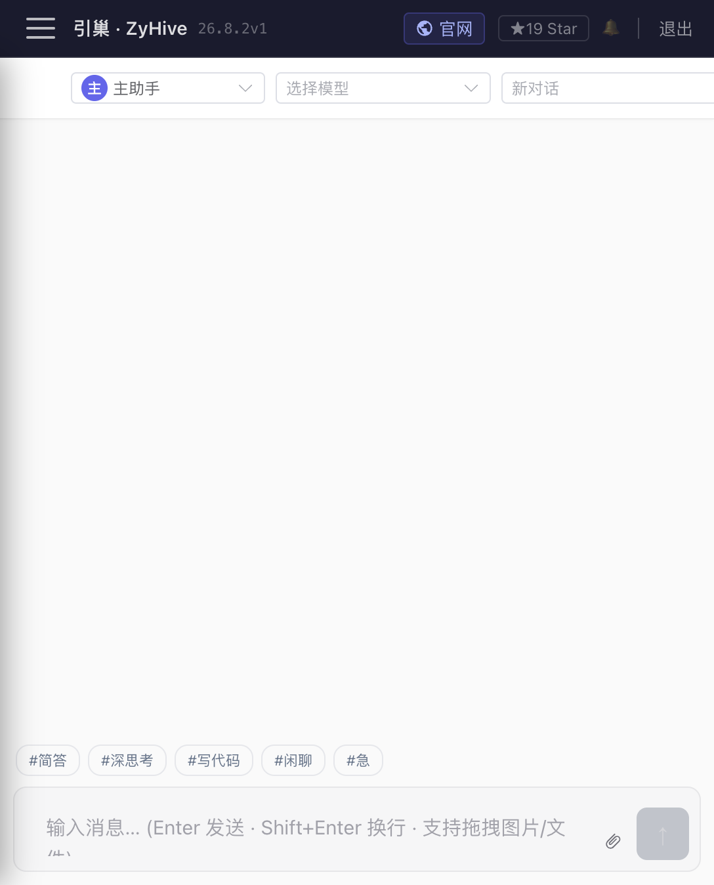

# 成员与对话

> 分类：**Stable 核心**。后台子成员任务属于 Stable，但当前不具备重启后续跑能力。

## 1. 成员由什么组成

每个成员既是一条管理记录，也是一套独立文件和运行上下文：

- `config.json`：名称、说明、模型 ID、成员级渠道、头像色、环境变量、心跳和工具策略。
- `workspace/IDENTITY.md`：身份与职责。
- `workspace/SOUL.md`：行为风格和长期准则。
- `workspace/memory/`、`workspace/network/`、`workspace/skills/`：记忆、通讯录和技能。
- `sessions/sessions.json`：会话轻量索引。
- `sessions/<sessionId>.jsonl`：完整追加式消息、工具卡展示信息和压缩记录。

实际根目录是 `<agents.dir>/<agentId>/`。服务启动时将目录收紧到仅当前系统用户可读写，并忽略不安全、重复或目录名与 `config.json` 中 ID 不一致的成员。内置 `__config__` 是系统配置助手，不能删除；首次没有普通成员时会创建 `main`。

## 2. UI 与 API

「成员」页 `/agents` 用于列表、创建和删除；成员详情 `/agents/:id` 集中编辑身份、灵魂、Owner 档案、工作区、记忆、关系、技能、定时任务、渠道、工具权限和环境变量。

主要管理 API：

- `GET/POST /api/agents`
- `GET/PATCH/DELETE /api/agents/:id`
- `POST /api/agents/:id/start|stop`
- `POST /api/agents/:id/message`：成员间同步消息
- `GET/PUT/DELETE /api/agents/:id/files/*path`

成员状态为 `running`、`stopped` 或默认的 `idle`。它表示运行/管理状态，不代表 Provider 一定健康。创建成员会在服务端建立目录并初始化工作区；如果初始化失败会清理本次新目录。不过当前创建页还会在成员创建后分步保存身份、渠道和记忆配置，后续步骤失败可能形成“成员已创建但附加配置不完整”，应进入详情页逐项核对。

## 3. 对话与会话如何运行

管理端首页 `/` 选择成员、模型和历史会话，通过 `POST /api/agents/:id/chat` 创建或续接一次 turn。后端 Worker 按 `{agentId, sessionId}` 隔离运行，SSE 依次返回文本增量、工具调用、压缩、用量、完成或错误事件。刷新或断线后，前端可用：

- `GET /api/agents/:id/chat/status?sessionId=...` 检查 `idle|generating`；
- `GET /api/agents/:id/chat/stream?sessionId=...` 重放缓冲事件并续接实时流。

会话上下文不是只把聊天记录原样发送给模型。系统会组合当前时间、Owner 档案、`IDENTITY.md`、`SOUL.md`、记忆索引、通讯录/关系、当前对话方摘要、能力体检、`AGENTS.md` 引用和项目权限；长会话达到阈值时先生成压缩摘要，再保留较新的消息。原始 JSONL 历史仍在，模型看到的是摘要加压缩边界后的消息。

会话标题先取首条用户消息，随后可在固定消息数里程碑自动总结。手工重命名后不会再被自动标题覆盖。对话管理页 `/chats` 可按成员和来源筛选、查看、重命名或删除；Telegram/飞书来源在管理面板中为只读。

## 4. 输入与输出

- Enter 发送，Shift+Enter 换行。
- `#简答`、`#深思考`、`#写代码`、`#闲聊`、`#急` 只是追加到消息中的风格提示，不是强制执行策略。
- 工具调用以折叠卡展示；完整输入/结果要到“工具审计”查看。
- 每条完成事件可显示 input/output Token；金额是按内置价格表估算，不是 Provider 账单。
- 切换会话或离开组件会中止当前前端请求，后台 Worker 是否仍运行要以状态接口为准。

## 5. @成员与派遣

成员间转发使用成员消息 API；真正的后台委派由任务系统执行。目标成员选择受关系表约束：上下级、平级协作等关系决定可派遣或汇报对象。子任务有独立 `sessionId`，状态为 `pending`、`running`、`done`、`error`、`killed`，完成后向父会话注入任务通知并显示结果。

任务详情和全局后台任务页每 5 秒轮询运行任务。服务重启时，旧的 `pending/running` 会被标记为 `killed`，事件时间线主要在内存中，不能从检查点继续；需要重新派遣。

## 6. 常见错误与处理

- **没有可用模型**：先到「模型配置」确认 Provider 为 `ok`、至少有一个模型，并给成员绑定模型。
- **401/403**：重新登录；若刚修改 Token，旧 Token 在服务重启前仍有效，新 Token 重启后才生效。
- **429**：Provider 限流或公共入口限流，等待后重试；不要并发重复发送。
- **上下文过长**：让系统完成压缩，或新建会话；不要反复提交同一大附件。
- **SSE 中断**：页面会尝试续接；若状态为 `idle` 且没有显式完成，按中断处理并重试，不要假定结果已经完整落盘。
- **工具被拒绝/等待**：查看顶栏审批铃铛和成员工具策略；审批不可用、超时或请求取消都默认拒绝。
- **任务找不到目标成员**：先在「通讯录 → AI 成员网络」建立允许的关系。
- **成员删除失败**：系统成员不可删除；删除普通成员会停止 Bot 并递归删除其目录，操作不可撤销，应先备份。

## 7. 限制

当前没有多用户会话隔离或 RBAC；持有管理员 Token 即拥有管理权限。会话文件是单机 JSONL，不是可横向扩展的数据库。后台任务没有持久化步骤、暂停/恢复或跨重启运行；同一成员的浏览器自动化认证状态也不应视为强隔离环境。
