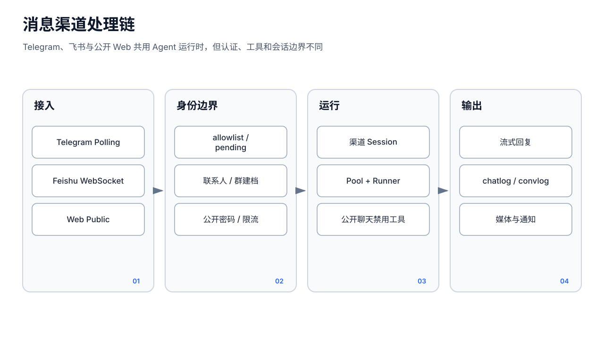

# 消息渠道

> 分类：成员级 Telegram、飞书和 Web 为 **Stable 核心**。新增渠道类型暂停；iMessage、WhatsApp 和全局渠道注册表不应视为稳定可用能力。

## 1. 正确入口：成员级渠道

每个成员在 `config.json` 的 `channels[]` 保存自己的渠道凭据和行为。请从「成员 → 详情 → 渠道」添加和管理，API 为：

- `GET/PUT /api/agents/:id/channels`
- `POST /api/agents/:id/channels/check-token`
- `POST /api/agents/:id/channels/:channelId/test`
- 待授权用户：`GET .../pending`、`POST .../allow`、`DELETE .../pending/:userId`
- 白名单删除：`DELETE .../allowed/:userId`

保存渠道和“当前 Bot 已启动”是两件事。Web 渠道保存后立即由 HTTP 路由读取；Telegram/飞书配置变更的 UI 会提示重启后新渠道生效，测试成功也不保证长连接已启动。

`status` 为 `ok|error|untested`，表示最近一次测试。Token/Secret 在 API 中应脱敏；不要把明文贴进对话、日志或截图。

## 2. Telegram

每个成员绑定独立 Bot Token。流程：

1. 输入 Token，前端调用 check-token 检查有效性和是否被其他成员/渠道占用。
2. 保存并启用渠道。
3. 测试连接；成功可显示 Bot 用户名。
4. 未在 allowlist 的用户首次发消息会进入待授权列表；管理员允许后才正常处理。

每个 Telegram chat 使用独立持久会话，图片等媒体会按渠道逻辑处理。私聊发送者自动建立 `network/contacts/telegram-*.md`；群聊还会建立 `network/chats/telegram-*.md`。在管理端打开 Telegram 会话时为只读，回复应从 Telegram 或 `send_message` 工具发出。

常见错误：Token 无效、同 Token 重复绑定、Bot 未启动、用户未授权、群隐私模式/权限不足、网络访问 Telegram API 失败。测试仅验证当前 API 调用，不验证所有群、媒体和回调权限。

## 3. 飞书

飞书使用 App ID、App Secret 和 WebSocket 长连接。成员详情内的向导会依次检查凭据、应用发布、所需 OAuth scopes、事件订阅、长连接开关和已加入群。

探测 API：

- `POST /api/feishu/probe`
- `POST /api/feishu/test-connect`
- `GET /api/agents/:id/channels/:channelId/feishu-status`

固定错误类型包括 `auth_failed`、`app_not_published`、`missing_scopes`、`event_not_subscribed`、`long_conn_disabled`、`network`、`unknown`。按向导补齐后要重新检测并确认应用版本已发布；控制台里“已勾选”但未发布仍不可用。

飞书消息使用流式卡片回复，并按实际授权动态注册消息、群聊、日历、文档、表格、Bitable、图片和卡片工具。连接成功不代表每个工具都有 scope。群聊可配置仅 @ 时响应；发送者和群档案会写成员私有通讯录。

HTTP `/feishu/card-callback` 是外部回调入口，不使用管理员 Token。部署到公网时必须配合飞书验证、TLS、反向代理和重放防护；不要把它当作普通管理 API。

## 4. Web 公开渠道

Web 渠道保存标题、欢迎语、可选密码和 enabled 状态，生成 `/chat/<agentId>/<channelId>`。访客不需要管理员 Token；浏览器为每个成员/渠道生成 `sessionToken`，服务端据此恢复历史，并自动建 `web-*` 联系人。

密码通过 `X-Chat-Password` 发送，只在当前浏览器的 `sessionStorage` 暂存。它是共享访问口令，不是用户账号体系。关闭或删除渠道后，公开页返回 404/410 并显示“此对话已关闭”。

公开接口和安全限制详见[设置、更新与公开聊天](settings-update-public-chat.md)。

## 5. 会话、记忆和推送

渠道消息最终进入与管理聊天相同的成员 Runner、会话存储、工具策略、审批和用量记录。会话索引的 `source` 标记 `telegram|feishu|web`，对话管理页按来源筛选。

`delivery.mode=announce` 的 Cron 会尝试用成员渠道主动通知；`send_message`/`send_file` 也要求目标渠道已配置且运行。工具审批在渠道 turn 中同样生效；无人处理或审批服务不可用时默认拒绝，不会因来自 Bot 而自动放行。

## 6. 兼容页与真实限制

侧栏没有“消息通道”，但路由 `/config/channels` 和 `/api/channels` 仍保留全局注册表兼容页，界面甚至列出 iMessage/WhatsApp。该页不是当前稳定配置入口：

- 全局 `channels[]` 与成员 `channels[]` 是两份数据。
- 稳定运行链路使用成员级 Telegram、飞书和 Web。
- iMessage/WhatsApp 没有可依赖的完整连接实现，不能用“测试成功”作为可交付依据。

不要同时在全局页和成员详情维护同一个 Bot。迁移旧配置后，以成员详情看到并能真实收发为准。

## 7. 故障排查

1. 看成员渠道卡片的 enabled、status 和测试结果。
2. Telegram 检查 Token 重复与待授权用户；飞书按固定错误类型补权限、事件和发布。
3. 查看成员对话是否出现对应 `source`，再看系统日志和 `X-Trace-Id`。
4. 检查工具策略是否允许消息工具、审批是否超时。
5. Web 返回 429/503 时检查公开入口限额与并发，不要通过泄露管理员 Token 绕过。
6. 公开渠道绑定的成员可能加载真实 Owner、记忆和通讯录上下文；对外服务应使用专门、最小知识域的成员，不要直接公开内部主助手。
