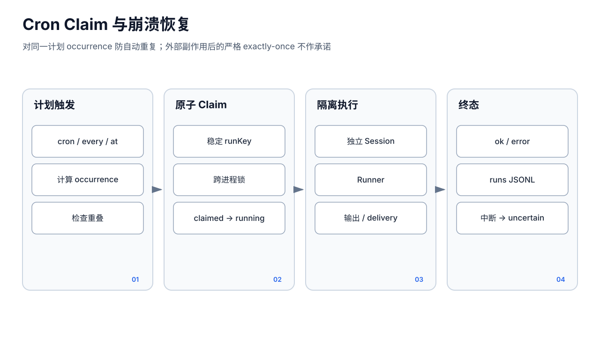
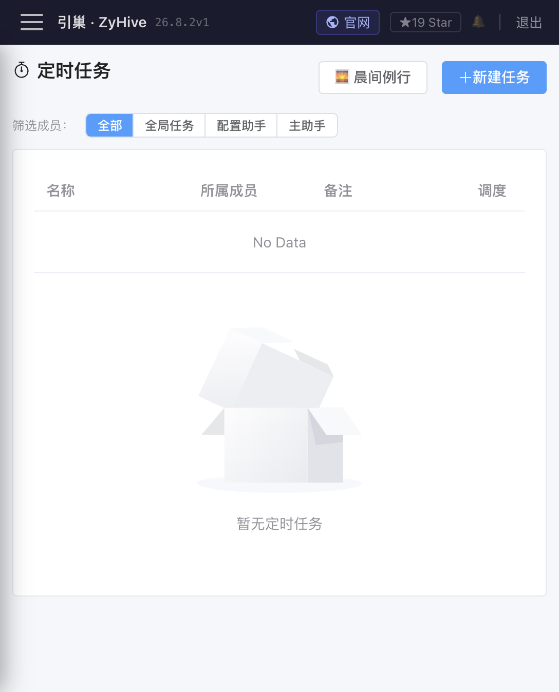
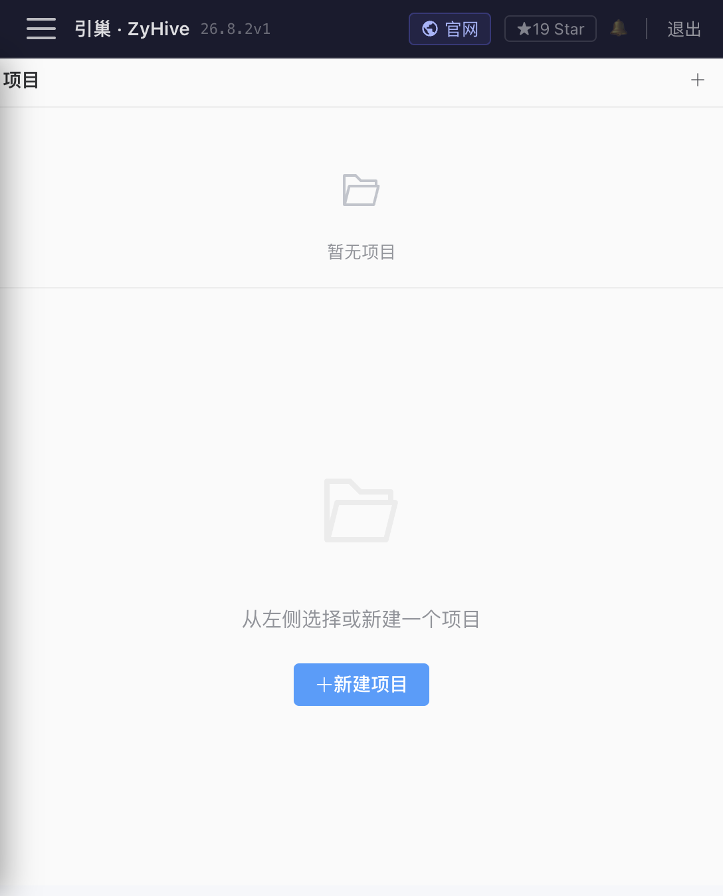
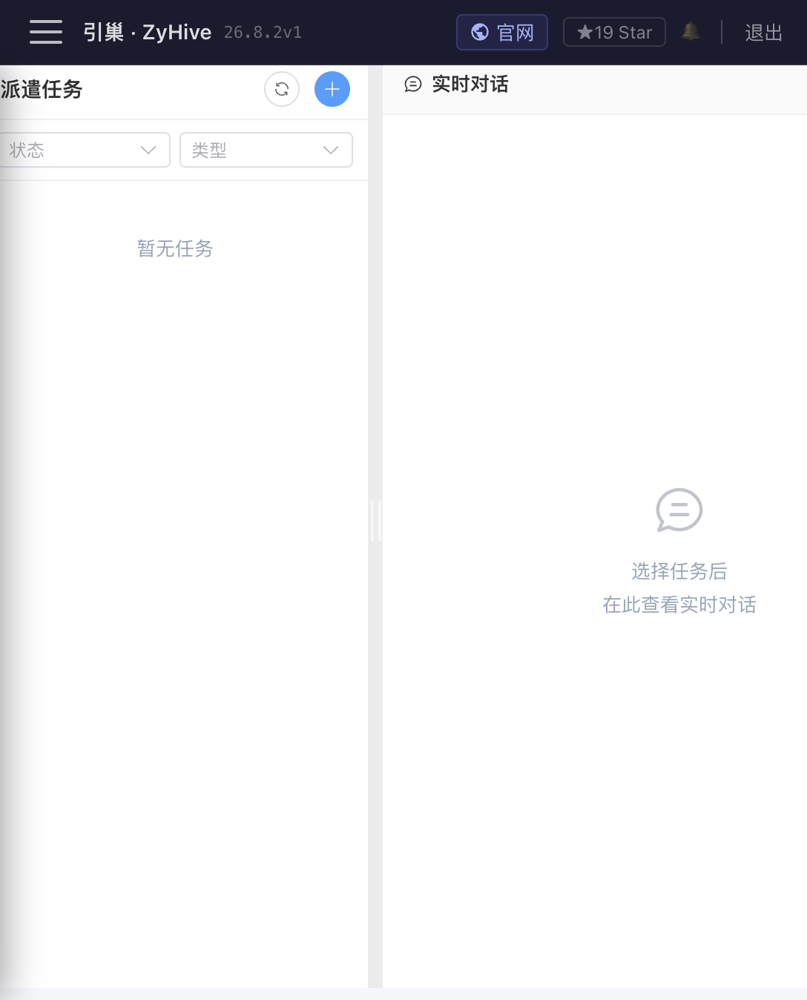

# 规划、定时任务、项目与后台任务

> **Stable**：Cron、共享项目、后台子成员任务。  
> **Labs**：Goals 高级甘特和模型规划助手；基础 CRUD 可用，但不作为稳定任务运行时。

## Stable：Cron

「定时任务」页 `/cron` 可按成员筛选，创建标准 Cron、固定间隔或一次性 `at`，立即运行并查看最近 50 条执行记录。

每次成员任务使用新的 `cron-{jobId}-{runId}` 隔离会话，不污染普通聊天。调度结构包括：

- `schedule.kind`：`cron|every|at`
- `expr`：5/6 段 Cron 表达式，或一次性本地/ISO 时间
- `everyMs`：固定间隔毫秒
- `tz`：IANA 时区
- `payload.kind`：通常为 `agentTurn`
- `delivery.mode`：`announce` 自动推送；`none` 只记录

`NO_ALERT` 是静默令牌：成员输出以它开头时仍记录运行，但不推送。晨间例行模板会整理昨日内容、检查愿望并在无事时返回该令牌。

运行状态：

- `ok`：执行完成；`announced=true` 才表示已经推送。
- `error`：模型、工具、持久化或推送流程失败。
- `skipped`：同一任务已有运行，重叠触发被跳过。
- `uncertain`/“待确认”：进程在 `claimed/running/executed` 窗口中断，系统为避免重复外部副作用不会自动重放。

连续 3 次失败会自动禁用。`at` 在执行一次后自动禁用，并规范为绝对时间。删除任务或停止服务会取消活动运行。

API 为 `/api/cron`、`/api/cron/:jobId/run`、`/runs` 和 `/enable`。数据位于服务工作目录的 `cron/jobs.json`、`cron/runs/` 与 `cron/claims/`。创建时服务端先校验调度；无效调度不会以成功任务落盘。即便有 occurrence claim，也无法让外部 API 的副作用具备端到端 exactly-once，`uncertain` 必须人工核对。

## Stable：共享项目

「项目」页 `/projects` 管理全局共享文件夹。数据位于服务工作目录 `projects/<projectId>/`，其中 `meta.json` 保存名称、说明、标签和编辑者，其他文件直接位于项目目录。

权限：

- `editors=[]`：所有成员可写，默认开放。
- `editors=["__none__"]`：所有成员只读。
- 其他列表：只有列出的成员可写。

管理 API `/api/projects` 支持 CRUD、`PUT /permissions` 和 `/files/*path`。成员工具使用 `project_list/read/write/glob/create`；管理 Token 可从 UI 管理，但成员运行时仍按项目 editors 校验。项目 ID 与文件路径受服务端边界保护。

项目是共享文件空间，不是 Git、事务数据库或实时协同编辑器。两个成员同时写同一文件可能后写覆盖前写；删除项目会递归删除目录，应先备份。

## Stable：后台任务

「后台任务」页 `/tasks` 可选择发起成员、目标成员、派遣/汇报类型、说明和可选模型覆盖。若指定发起者，`GET /api/tasks/eligible` 根据关系图返回允许的目标；没有关系时会显示“无可用目标”。

状态：

- `pending`：已创建，等待执行。
- `running`：独立 Session 正在流式运行。
- `done`：成功并保存输出。
- `error`：执行失败，详情显示错误。
- `killed`：人工终止或服务重启时回收。

任务文件位于 `<agents.dir>/.subagent-tasks/<taskId>.json`，内容包括任务、上下文快照、来源/目标成员、Session、输出、附件或 Artifact 元数据。页面每 5 秒刷新活动任务，并用目标成员的独立会话展示实时过程。完成后会把 `<task-notification>` 和可读结果注入父会话。

限制：

- 当前没有 Mission/Run/Step/Checkpoint；重启前的 pending/running 统一变为 killed，不能续跑。
- 任务事件时间线主要在内存中，页面重载可在进程存活时恢复，服务重启后不保证。
- 管理端任务 API 是管理员特权视图；不要把任务所有权当成多租户安全边界。
- 终止是 context 取消，外部命令或第三方副作用是否已发生需另外审计。

## Labs：Goals

「规划」页 `/goals` 支持个人/团队目标、`draft|active|completed|cancelled`、0–100 进度、起止时间、负责人、里程碑、检查任务和甘特缩放。数据位于 `cron/goals.json`，检查记录位于 `cron/goals-checks/`；检查通过 Cron 关联成员执行。

API 为：

- `/api/goals` CRUD
- `/progress`、`/milestones/:mid`
- `/checks`、`/checks/:checkId/run`
- `/check-records`

目标状态不会自动证明实际工作已完成；进度和里程碑是管理记录。检查结果只有 `ok|error`，应阅读输出。起止时间与 Cron 的联动包含历史兼容逻辑，不能把目标视作可恢复工作流。

高级甘特与 Goals 模型助手属于 Labs。当前规划助手曾按产品决定允许把管理 API 操作上下文带给模型，存在管理员 Token 进入 Provider、会话或日志的风险；不要给不可信目标描述、外部网页内容或第三方模型使用该助手。需要自动执行时，优先用受控 Cron、项目工具和审批，而不是依赖模型生成的管理命令。

## 排错

- Cron 不触发：看 enabled、时区、下一次运行、连续错误禁用原因和 `/readyz`。
- “待确认”：先核对外部系统是否已产生副作用，再人工决定是否重新运行。
- 项目写入被拒：检查 editors，`__none__` 会拒绝所有成员写入。
- 任务立即失败：检查目标关系、目标模型、工具策略和任务错误字段。
- Goal 检查无记录：检查关联 `cronJobId`、成员是否存在、调度是否启用。
