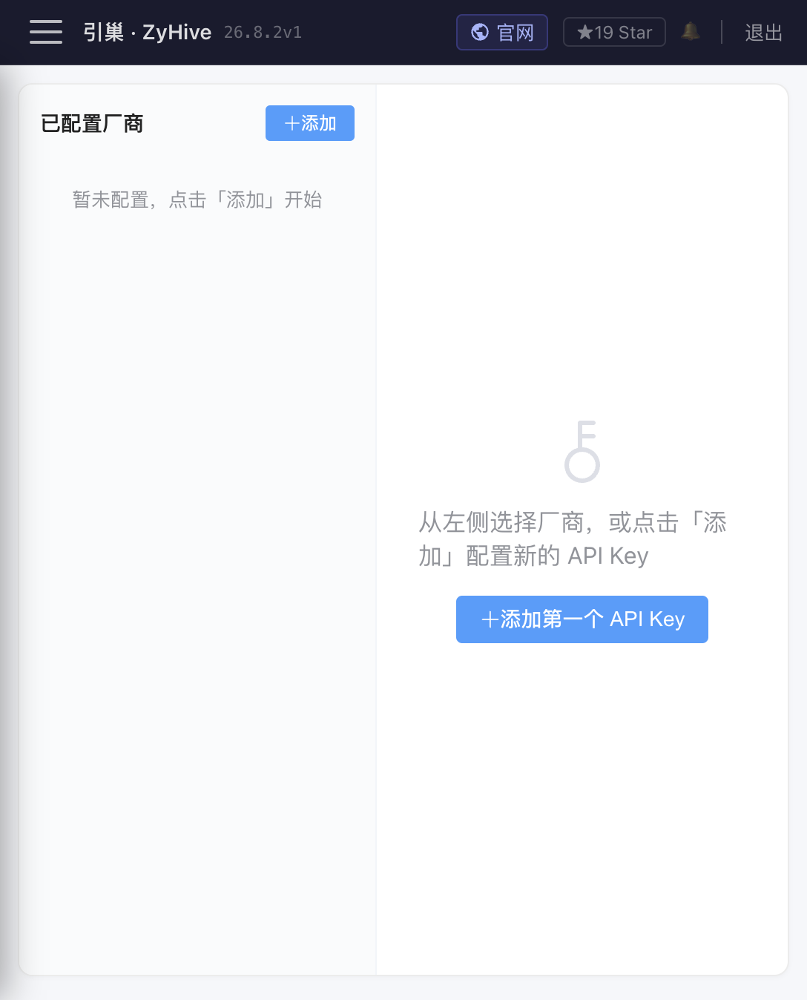

# 模型、工具与审批

> 分类：Provider、模型、工具策略与审批为 **Stable 核心**；ACP 编程代理为 **Labs**。宿主 Shell 当前默认可用，这是明确的高权限边界。

## Stable：Provider 与模型

「模型配置」页 `/config/models` 左侧管理 Provider 凭据，右侧管理其模型。Provider 支持 Anthropic、OpenAI、DeepSeek、Kimi、智谱、MiniMax、Qwen、OpenRouter、Ollama 和自定义 OpenAI-compatible 端点。

运行关系是：

1. Provider 保存 `provider`、`apiKey`、`baseUrl`、可选 `embedModel` 和测试状态。
2. 模型保存真实模型名、`providerId`、显示名、默认标记和 `supportsTools`。
3. 成员的 `modelId` 引用模型；未绑定时回退到全局默认模型。
4. 发起请求时才从模型解析关联 Provider 的凭据和 Base URL。

数据在主配置文件的 `providers[]` 与 `models[]`。API Key 在列表响应中脱敏；编辑时留空通常表示保留原值。主要 API 为 `/api/providers`、`/api/models`、`/api/models/probe` 和 `/api/models/env-keys`。

状态 `untested` 只表示未测，`ok` 表示最近一次最小探测成功，`error` 表示最近探测失败；它们不是持续健康保证。页面打开时会并发自动测试 Provider。删除被模型引用的 Provider 会被阻止，需先删除或迁移模型。

Ollama 不要求 Key，但只允许显式配置的本机精确回环端点；自定义 Base URL 和模型探测会阻断私网、链路本地、云元数据、危险重定向和 DNS 重绑定。Embedding 配置只服务记忆向量检索，主聊天模型正常不代表 Embedding 一定可用。

常见模型错误：

- `401/403`：凭据无效或无权限。
- `429`：额度/速率限制，系统只对瞬时错误做有限重试。
- `5xx/timeout`：Provider 或网络异常。
- `context_length`：当前会话超出模型上下文，应压缩或新建会话。
- 模型不支持 tools：将 `supportsTools=false`，否则模型可能拒绝含工具定义的请求。DeepSeek reasoner、部分 o1 系列会自动判定为无工具。
- 获取模型列表为空：目标端点可能未实现 OpenAI `/models` 兼容接口；可手工添加模型 ID。

## Stable：工具组成与动态注册

工具不是配置表中的一条记录就一定可执行。运行时 Registry 先注册内置工具，再按 Provider Key、渠道、浏览器、项目、SkillOpt 等依赖动态追加，最后执行策略裁剪和审批包装。成员详情的“工具体检”是最接近实际运行能力的结果，显示 `ready` 或 `blocked` 及原因。

常见组：

- `group:fs`：`read/write/edit/grep/glob`
- `group:runtime`：`exec/process/acp_list/acp_spawn`
- `group:web`：`web_fetch/web_search`
- `group:memory`：`memory_search`
- `group:ui`：浏览器与图像工具
- `group:agent`：成员派遣、结果和汇报
- `group:sessions`、`group:cron`、`group:messaging`
- `group:self`、`group:project`、`group:network`

「密钥管理」页 `/config/tools` 主要保存 Brave Search 等外部能力的 Key，也包含全局工具策略与 ACP 配置区域。数据在主配置 `tools[]`、`toolPolicy` 和 `acpAgents[]`；成员环境变量与成员策略在其 `config.json`。

## Stable：权限解析

策略有 `profile`、`allow`、`deny`、`ask`：

- `full`：基础上不限制。
- `coding`：文件、运行时、成员、记忆、图像和 Web 等编码相关能力。
- `messaging`：消息、会话和记忆检索。
- `minimal`：只允许 `send_message` 与 `memory_search`。
- `allow` 在当前层增加工具；`deny` 始终优先；`ask` 让已被允许的工具先等待人工批准。

全局策略是上限，成员策略只能继续收紧。工具必须同时通过每一层；成员的 `allow` 不能恢复全局 `deny`。未知字段、未知 Profile 或未知组会让治理配置失败关闭，Registry 会拒绝全部工具，而不是静默放开。

重要限制：当前缺少策略时默认为开放，`exec` 和 `process` 可直接在 ZyHive 服务用户的宿主环境执行。实验 sandbox 不等于容器、独立 UID、seccomp/cgroup 或网络隔离。面向不可信内容、公共网页或公开用户时，应显式 deny `group:runtime`、写文件、自修改和项目创建工具。

## Stable：审批过程

当工具命中 `ask`：

1. Runner 向进程级 Broker 创建请求并阻塞工具执行。
2. UI 先通过鉴权 REST 取得一次性短时 SSE ticket，再监听 `/api/approvals/stream`。
3. 顶栏铃铛显示工具名、输入和过期时间。
4. `POST /api/approvals/:id/approve|deny` 解除等待。
5. 允许后才真正调用工具；拒绝、5 分钟超时、上下文取消或 Broker 不可用都不执行。

待办可由 `GET /api/approvals/pending` 重新拉取，SSE 只是通知通道。审批 ID 已过期或已处理时会返回 not found/conflict，应刷新列表，不能重复批准。审批结论进入审计 Hook；工具本身的输入、结果、耗时和错误另写工具审计。

## Labs：ACP

ACP 通过 `/api/acp` 配置外部编码 CLI 的二进制、参数、工作目录和环境变量，运行时由 `acp_*`/`process` 管理。它会启动真实子进程，当前应视为 Labs 高权限功能：

- 二进制必须已安装且服务用户可执行。
- 默认工作目录是成员工作区，但外部程序自身能力不天然受 CapabilityFS 限制。
- 后台进程有成员/会话所有权、并发、输出和时长约束，但不是强沙箱。
- 服务关闭会回收受管进程；崩溃恢复和任务检查点不保证。

## 故障排查顺序

先看成员“工具体检”，再看 Provider 状态、全局/成员策略、审批铃铛、工具审计，最后用 `X-Trace-Id` 查系统日志。不要只根据侧栏是否出现、配置记录是否 enabled 或模型口头声称来判断能力是否真实可用。
