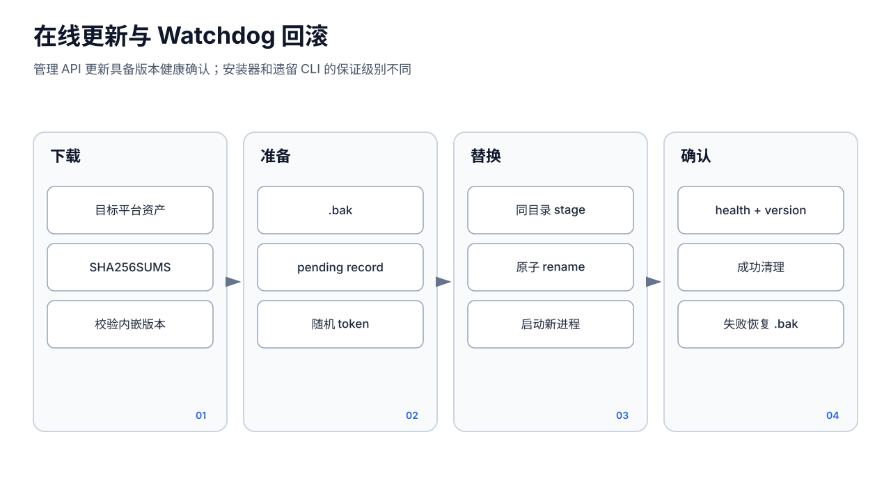
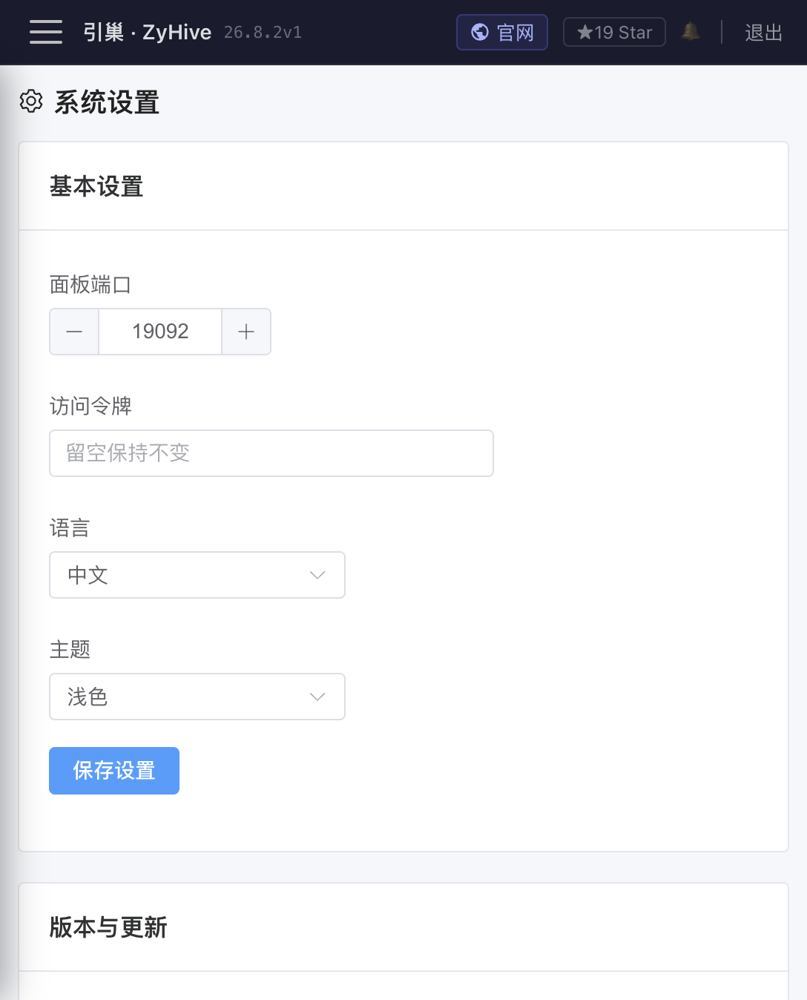

# 设置、更新与公开聊天

> 分类：系统设置、在线更新和 Web 公开聊天为 **Stable 核心**。仍受单机 Beta、明文备份和公开知识域隔离不足等限制。

## 1. 登录与远程服务器

登录页使用管理员 Token 访问管理 API。前端每次请求从浏览器本地存储读取当前服务器地址和 `aipanel_token`，并发送 Bearer Token。`401` 会清除 Token 并跳转 `/login`。

服务端认证是强制边界：

- Token 缺失：管理 API 返回 `503 authentication is not configured`，不会匿名放行。
- Token 错误：返回 `401 unauthorized`。
- `/api/version`、`/api/update/status`、`/healthz`、`/readyz` 和公开聊天等少数端点不要求管理员 Token。

若面板与 API 分域，需在 `gateway.cors.allowedOrigins` 或 `gateway.publicUrl` 精确配置 Origin。允许列表不支持随意通配；反向代理转发协议与 Host 必须正确。

## 2. 基本设置与“待重启”

「系统设置」页 `/settings` 当前可改面板端口和访问令牌；中文与浅色主题是唯一可选项，英文和深色禁用。读取/保存使用 `GET/PATCH /api/config`。

端口与 Token 写入配置后不会热替换正在监听的端口或已捕获的鉴权中间件。响应包含 `runtime.restartRequired`、`activePort` 和变更字段，页面显示“设置已保存，重启服务后生效”：

- 重启前继续使用旧地址和旧 Token。
- 重启后改用新端口，并用新 Token 重新登录。
- 远程改端口前先确认防火墙、反向代理和新地址可达，避免失联。

主配置通过临时文件、同步和原子替换保存；失败请求不应污染运行中配置快照。直接编辑文件则绕过 API 校验，必须自行重启并承担格式错误风险。

## 3. 在线更新

设置页和顶栏共用一个更新状态机：

- `GET /api/update/check`：比较当前与最新正式版本。
- `POST /api/update/apply`：启动更新。
- `GET /api/update/status`：重启期间也可匿名轮询。

阶段为 `idle → downloading → verifying → applying → done`，失败为 `failed`，自动恢复旧程序后为 `rolledback`。更新器先下载并校验 SHA-256，再替换程序；新进程需通过健康检查，否则回滚。

更新只替换程序文件，设计上保留配置、成员、项目、Cron 和对话，但这不是备份替代。更新前仍应通过 CLI 创建备份并校验归档。当前前端没有完整的备份/恢复入口，备份是明文 tar.gz，包含凭据和用户数据。

页面会轮询新版本并提示刷新。如果 90 秒仍未确认目标版本健康，应按“未知/失败”处理，查看旧服务是否仍在、新二进制权限、端口冲突和系统日志；不要仅凭进度 100% 判断升级成功。安装器和在线更新默认消费摘要完整性，发布者身份签名验证仍不是所有路径的强制默认。

## 4. Web 公开聊天

成员详情创建 Web 渠道后获得 `/chat/<agentId>/<channelId>`。公开页调用：

- `GET /pub/chat/:agentId/:channelId/info`
- `GET .../history?sessionToken=...`
- `POST .../stream`
- `GET .../reconnect?sessionId=...`

访客浏览器为每个成员/渠道生成 `sessionToken` 存入 localStorage，并把服务端 `sessionId` 另存以便刷新时重连。可选访问密码通过 `X-Chat-Password` 发送，成功后只存当前 tab 的 sessionStorage。它不是账号、身份验证或细粒度权限。

`404/410` 表示成员/渠道不存在、禁用或删除；`401` 表示密码错误；`429` 表示频率、会话或并发限制；`503` 常表示系统/模型暂不可用。SSE 只有收到显式 `done` 才应视为完整；连接中断会显示连接错误并可用 reconnect 恢复正在生成的会话。

## 5. 公开入口默认限额

默认服务端硬限制包括：

- 每来源每分钟最多 60 个公共请求、12 次模型执行。
- 每来源 24 小时最多 8 个会话。
- 全局最多 100 个 30 分钟活跃会话。
- 同时最多 4 个公共模型任务、32 条公共 SSE。
- 同一会话只允许一个任务运行。
- 单条消息最多 16 KiB，单次执行最多 2 分钟。

可通过 `ZYHIVE_PUBLIC_REQUESTS_PER_MINUTE`、`ZYHIVE_PUBLIC_RATE_PER_MINUTE`、`ZYHIVE_PUBLIC_MAX_SESSIONS`、`ZYHIVE_PUBLIC_MAX_ACTIVE_SESSIONS`、`ZYHIVE_PUBLIC_MAX_CONCURRENT`、`ZYHIVE_PUBLIC_MAX_SSE`、`ZYHIVE_PUBLIC_MAX_MESSAGE_BYTES`、`ZYHIVE_PUBLIC_RUN_TIMEOUT`、`ZYHIVE_PUBLIC_SESSION_TTL`、`ZYHIVE_PUBLIC_ACTIVE_SESSION_TTL` 调整。

仅当服务位于可信反向代理后才设置 `ZYHIVE_TRUST_PROXY_HEADERS=1`，否则攻击者可伪造来源 IP 绕过按来源限制。公开入口的 `web_fetch`、浏览器流量和动态模型 Base URL 同样阻断本机、私网和云元数据地址。

## 6. 公开聊天的关键安全边界

公开 Registry 强制 `Deny:["*"]` 且 `SupportsTools=false`，因此公开访客不能调用任何工具。但 Runner 仍可能使用该成员真实工作区构建系统提示词，注入 Owner 档案、记忆索引、通讯录、关系、会话索引和 `AGENTS.md`。风险来自提示词上下文，而不是仍有工具开放；“没有工具”也不等于“看不到私有上下文”。

上线公开聊天时：

1. 新建专门成员，不使用内部主助手。
2. 清空敏感 Owner、memory、network、projects 和 AGENTS 引用。
3. 仍将成员策略收紧为 `minimal`，作为误接入管理端或未来配置变化时的纵深防御；不要把它误认为公开 Registry 的主要隔离。
4. 只配置公开用途模型和最少渠道，不复用内部环境变量。
5. 使用强随机渠道密码、TLS、反向代理限流和日志告警；密码不能替代真正的用户体系。
6. 定期检查公开联系人、会话、用量和工具审计，必要时禁用渠道。

## 7. 设置与更新排错

- 保存后仍走旧端口/Token：这是预期的待重启状态。
- 重启后登录失败：用新 Token；若遗失，从服务器配置文件或 `zyhive token` 恢复。
- 更新检查失败：检查服务出站 GitHub/镜像网络、DNS、代理和系统时间。
- 更新回滚：保留旧版本运行，查看 status message 与系统日志后再重试。
- 公开页一直加载：检查渠道 enabled、成员存在、反向代理是否转发 `/pub` 和 SSE。
- 历史不见：确认同一浏览器的 localStorage sessionToken 未被清理，且使用同一 channelId。
