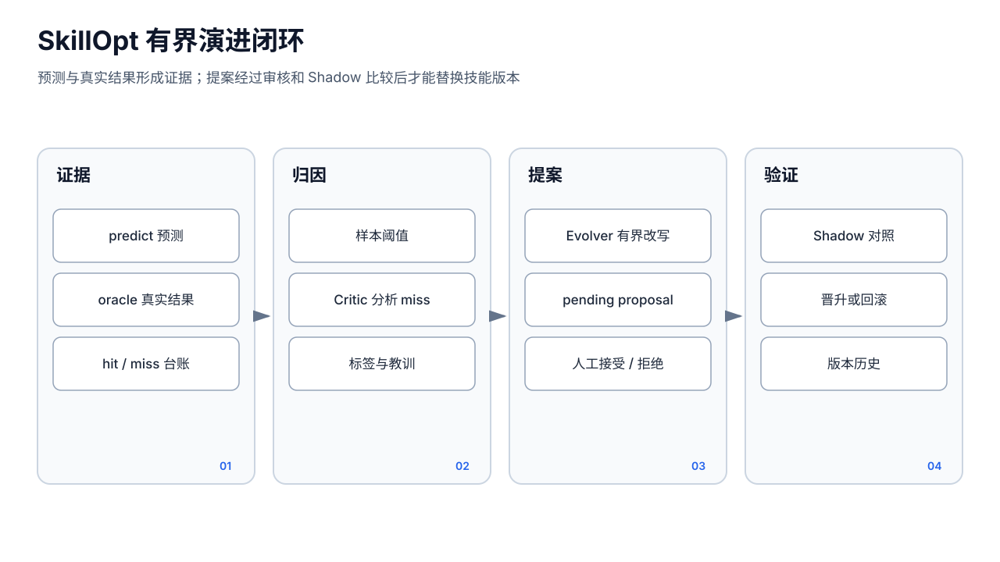

# 技能与 SkillOpt

> **Stable**：成员静态技能、技能库、启停、编辑和复制。  
> **Labs**：SkillOpt 预测—事实回填—归因—进化—影子 A/B 闭环。


## Stable：技能是什么

技能是成员工作区中的一组本地文件：

```text
<workspace>/skills/<skillId>/
├── skill.json
└── SKILL.md
```

`skill.json` 保存 ID、名称、版本、图标、分类、说明、启用状态、安装时间和来源；`SKILL.md` 保存详细操作指令。技能库 `/skills` 跨成员聚合显示技能，可按成员和关键字筛选、启停、删除、跳转编辑或复制给其他成员。

成员技能 API：

- `GET/POST /api/agents/:id/skills`
- `PATCH/DELETE /api/agents/:id/skills/:skillId`
- 文件正文仍通过 `/api/agents/:id/files/skills/:skillId/SKILL.md` 读取。

全局 `/api/skills` 注册表是旧的安装兼容接口，写主配置 `skills[]`；当前实际运行和技能库以成员工作区中的 `skill.json` 为准。两者不要混为同一份数据。

## Stable：技能如何进入模型上下文

Runner 只直接注入 `skills/INDEX.md` 的轻量摘要，不会把所有 `SKILL.md` 全量塞进每轮提示词。模型根据任务识别技能后，再用 `read` 读取完整正文。因此：

- `enabled=false` 的技能不应出现在有效索引中。
- 修改 `SKILL.md` 后从后续 turn 生效。
- 技能不是可执行插件；真正动作仍由工具完成，并受 ToolPolicy 与审批限制。
- 技能中的文字不能提升权限，也不能绕过全局 deny。

复制技能时，UI 读取源成员的 `SKILL.md`，再在目标成员创建新的元数据与正文。同 ID 已存在会失败，需要改 ID。删除会递归移除整个技能目录，包括可能存在的 SkillOpt 历史，无法从 UI 撤销。

常见错误：

- 技能列表缺失：确认 `skill.json` 可解析、目录 ID 正确并刷新技能库。
- 编辑后模型没使用：检查启用状态、`skills/INDEX.md` 是否更新，以及任务是否足以触发按需读取。
- 复制失败：目标同 ID、磁盘不可写或源正文读取失败。
- 技能能描述但不能执行：所需工具未注册、被策略 deny、等待审批或缺少 API Key。

## Labs：SkillOpt 运行原理

SkillOpt 不应当作自动正确的“自我升级”。它将可验证预测写入台账，由用户或外部事实回填命中结果，积累失败样本后调用成员模型做归因和有界改写，再用影子样本比较新旧版本。



流程：

1. `predict` 写一条预测，可附上下文摘要和来源会话。
2. `oracle` 写真实结果与 `hit=true|false`。
3. 达到 `sampleThreshold`，Critic 只对 miss 样本提取标签和教训。
4. Evolver 只改 `SKILL.md` 中 `skillopt:rules` 与 `skillopt:lessons` 标记区；没有标记时首次在末尾追加。
5. 生成 `pending` 提案。手工接受或 `autoAccept` 后状态为 `accepted`，进入 shadow。
6. 影子样本达到 `shadowMinSample`，且命中率比基线高至少 `promoteMargin` 时晋升为 `promoted`；否则拒绝并记录指纹，避免重复尝试。
7. 每个版本保存快照，可手工回滚；“强制晋升”会跳过统计判断，应谨慎使用。

UI 位于成员技能编辑中的“技能进化 · SkillOpt”面板，展示基线/影子命中率、待回填数、待审提案、自动维护、阈值、台账、提案和版本。

## Labs：API 与数据

前缀为 `/api/agents/:id/skills/:skillId/skillopt`：

- `GET /`、`PUT /config`
- `POST /predict`、`POST /oracle`、`GET /ledger`
- `POST /evolve`
- `GET /proposals` 与提案 accept/reject
- `GET /versions`、版本 rollback
- `POST /shadow/promote`

数据完全位于该成员技能目录：

```text
skillopt/
├── ledger.jsonl
├── epoch.json
├── lessons.md
├── proposals/<proposalId>.json
└── versions/v<N>-SKILL.md
```

开启“每日维护”会建立内部 Cron 哨兵任务，直接调用 SkillOpt manager；它不是普通聊天 turn。Critic/Evolver 仍需成员模型可用。聚合教训还可能写入 `skills/SKILLOPT_LESSONS.md`，供后续系统提示词读取。

## Labs：状态、错误与边界

- `initialized=false`：尚无 `epoch.json`，不是损坏。
- `pendingOracle>0`：预测没有事实回填，不能用于命中率。
- `pending`：提案等待人工决定。
- `accepted`/“影子灰度中”：新内容尚未成为正式基线。
- `promoted`：已晋升并写版本快照。
- `rejected`：人工拒绝或评估未达标。

“暂无可进化内容”通常表示没有足够已回填失败样本；进化失败常见于成员模型不可用、返回内容不符合有界格式、标记区校验失败或磁盘不可写。回滚会替换当前 `SKILL.md`，不能恢复回滚后新产生但未快照的手工编辑。

SkillOpt 当前 manager 在主程序中构造，路由也会在 manager 非空时注册；这尚不等同于完善的 Labs 总开关隔离。其数据格式、阈值和自动行为可能改变。对于法律、医疗、金融、安全或不可逆操作，不要启用自动接受或强制晋升；事实 Oracle 必须来自可信来源，错误标签会把系统向错误方向优化。
