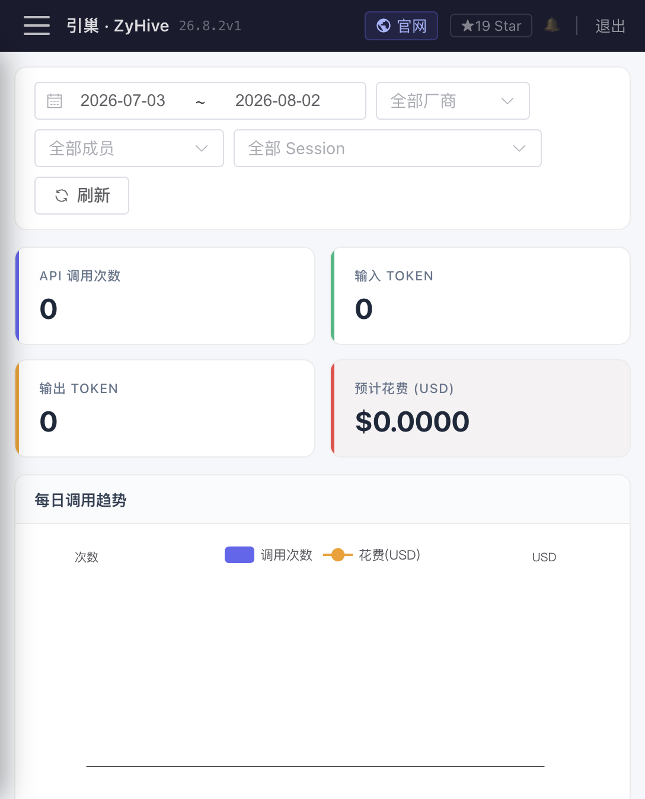
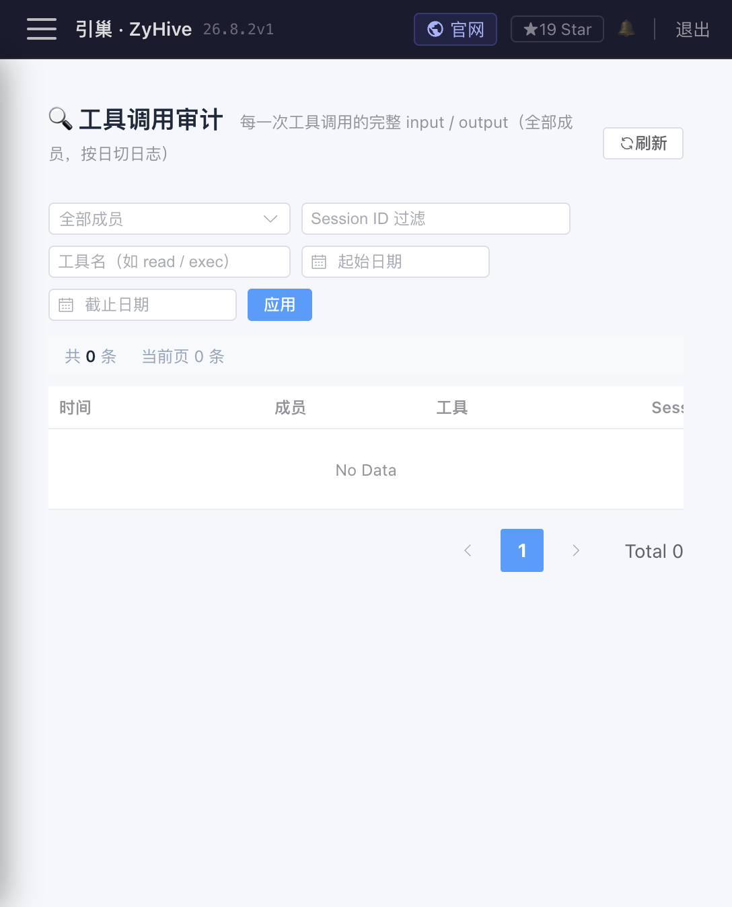

# 用量、工具审计与系统日志

> 分类：三者均为 **Stable 核心可观测能力**，但目前尚未统一为完整 Trace，也不等于第三方账单或合规 SIEM。


## 1. 三类记录不要混用

- **用量**：一次模型 API 调用的 Token 与估算费用。
- **工具审计**：一次工具调用的完整输入、结果、耗时与错误。
- **系统日志**：服务进程、HTTP、Runner、渠道和外部依赖的文本运行日志。

对话历史是第四类数据，保存在成员 `sessions/`，用于恢复消息；它不是工具全量审计，也不能替代系统日志。

## 2. 用量统计

「用量统计」页 `/usage` 默认查询最近 30 天，可按日期、Provider、成员和 Session 过滤，展示调用次数、输入/输出 Token、预计 USD、每日趋势、Provider/成员分布和分页明细。



API：

- `GET /api/usage/summary`
- `GET /api/usage/timeline`
- `GET /api/usage/records`

筛选参数包括 `from`、`to`（Unix 秒）、`provider`、`agentId`、`sessionId`、`page`、`pageSize`。Session 下拉只有先选成员才加载，最多请求 200 个会话供选择。

数据位于 `<agents.dir>/.usage/YYYY-MM.jsonl`，每行保存 `agent_id`、可选 `session_id`、Provider、模型、输入/输出 Token、估算费用和 Unix 时间。旧记录可能没有 Session ID；删除成员后其历史仍会按 ID 出现在统计中。

限制：

- 费用来自内置模型价格表，是估算，不含缓存折扣、批量价、税、汇率、平台加价和 Provider 账单修正。
- 未识别模型可能按默认/零价格计算。
- 只有实际走 UsageRecorder 的 LLM 调用才记录；外部 ACP、自行执行的 curl 或渠道平台费用不在内。
- JSONL 当前按月扫描聚合，数据量很大时查询会变慢；没有内置保留、归档或导出 UI。

## 3. 工具审计

「工具审计」页 `/tool-audit` 可按成员、日期、工具名和 Session 查询，列表显示时间、成员、工具、耗时和成功/失败；点详情读取完整输入、结果或错误。聊天工具卡的“详情”也按 `toolCallId` 打开同一数据。



API：

- `GET /api/tool-audit`
- `GET /api/agents/:id/tool-audit/:toolCallId`
- `GET /api/agents/:id/sessions/:sid/tool-audit`
- `GET /api/agents/:id/tool-audit/blobs/:name`

每个成员数据位于 `<agents.dir>/<agentId>/tool-audit/`：

```text
tool-audit/
├── YYYY-MM-DD.jsonl
└── blobs/
    ├── <toolCallId>_input.bin
    └── <toolCallId>_result.bin
```

单个输入或结果超过 200 KiB 时，JSONL 只保存 blob 引用。列表默认查询近 7 天，单次 limit 最大 500；按 ID 详情最多向前扫描约 14 天，因此很旧的 ID 可能查不到，即使文件仍在磁盘。成功由 `error` 是否为空判断；“成功”只表示工具 Handler 返回成功，不证明外部业务结果正确。

工具审计可能包含文件内容、命令输出、网页文本和传入工具的秘密。目录权限会收紧，但没有字段脱敏或静态加密；导出、备份和共享截图前必须审查。

审批日志与工具日志也不同：审批记录“谁允许/拒绝/超时”，工具审计记录“允许后实际执行了什么”。拒绝的工具不会有正常执行结果。

## 4. 系统日志

「日志」页 `/logs` 调用 `GET /api/logs?limit=N`，`N` 最大 2000。后端按以下顺序读取：

1. `/tmp/aipanel.log`
2. Linux：`journalctl -u zyhive`
3. macOS：最近一小时中进程路径包含 `zyhive` 的 unified log
4. 都不可用时返回空数组，`source=none`

因此“日志页面为空”不代表没有错误，可能只是服务以其他方式启动或日志不在这些来源。容器、手动前台运行、自定义 systemd unit 名称时，应查看实际 stdout/stderr 或部署平台日志。

每个 HTTP 请求会分配 `trace_id`，响应头为 `X-Trace-Id`，并贯穿 SSE、Runner、工具和 LLM client 的相关日志。生产可用 `LOG_FORMAT=json` 与 `LOG_LEVEL=debug|info|warn|error` 调整格式和级别；debug 可能暴露更多上下文，不应长期对外收集。

## 5. 状态与排错方法

建议顺序：

1. 记录失败请求的时间、成员、Session、HTTP 状态和 `X-Trace-Id`。
2. 若是模型问题，先查用量是否产生记录，再查 Provider 状态和系统日志。
3. 若是工具问题，查工具审计的 input/result/error/duration，再查审批是否拒绝或超时。
4. 若是渠道/Cron/后台任务，查各自运行记录，再用 trace ID 关联系统日志。
5. 磁盘写入失败时，UI 可能只显示通用“加载失败/保存失败”；检查文件权限、空间、只读挂载和服务用户。

当前三套数据没有统一 Event/Trace 数据库，跨入口关联主要依赖时间、agentId、sessionId、toolCallId 与 trace_id。JSONL 文件不应在服务运行时被外部程序原地改写；需要分析时复制只读副本。
