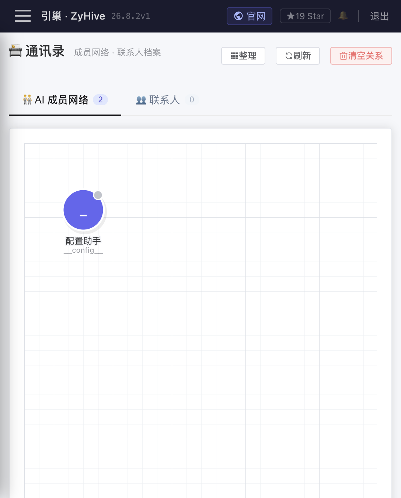

# 工作区、记忆与通讯录

> 分类：**Stable 核心**。自动记忆整理可用，但它依赖成员模型与 Cron，不等同于无损知识库。


## 1. 工作区

每个成员的工作区位于 `<agents.dir>/<agentId>/workspace/`。成员详情中的文件树通过 `/api/agents/:id/files/*path` 读写，服务端限制访问范围，资源 ID、`..`、绝对路径和越界符号链接不能用来逃离成员目录。

常见内容：

```text
workspace/
├── IDENTITY.md
├── SOUL.md
├── AGENTS.md                 # 可选，支持引用其他工作区文件
├── WISHLIST.md
├── memory/
├── network/
└── skills/
```

`IDENTITY.md` 回答“我是谁、负责什么”；`SOUL.md` 约束风格和原则。它们会进入每轮系统上下文，修改后从后续 turn 生效。普通文件不会自动全部注入；需要通过索引、`AGENTS.md` 引用或 `read` 工具按需读取。

## 2. 四层记忆

记忆目录是：

- `memory/core/`：长期稳定信息，如知识、偏好、关系；`owner-profile.md` 描述服务对象。
- `memory/projects/`：按项目组织的背景、决策和进展。
- `memory/daily/YYYY/MM/DD.md`：按 Asia/Shanghai 记入的日常流水。
- `memory/topics/`：按主题长期积累。
- `memory/INDEX.md`：轻量总索引，每轮直接注入。

UI 的记忆树调用：

- `GET /api/agents/:id/memory/tree`
- `GET/PUT /api/agents/:id/memory/file/*path`
- `POST /api/agents/:id/memory/daily`
- `GET/PUT /api/agents/:id/memory/config`
- `POST /api/agents/:id/memory/consolidate`
- `GET /api/agents/:id/memory/run-log`

记忆整理配置包括 `enabled`、`schedule`、`keepTurns`、`focusHint` 和关联 `cronJobId`。开启后会创建内部 Cron；也可以点“立即整理”。整理调用成员模型，将短期内容提炼到长期文件，运行记录为 `ok|error`。这是一种 LLM 归纳：可能遗漏、概括错误或覆盖表达细节，重要事实应人工复核，原会话记录仍是审计来源。

`memory_search` 优先使用配置的 Embedding 模型做向量检索；没有可用 Embedding 时降级为 BM25。语义检索失败不代表文件不存在，可直接用文件树或 `read`。

## 3. 通讯录与群档案

每个成员有独立通讯录：

```text
workspace/network/
├── INDEX.md
├── RELATIONS.md
├── changes.log
├── contacts/<source>-<externalId>.md
├── chats/<source>-<externalChatId>.md
└── avatars/
```

内部实体 ID 的语义格式是 `{source}:{externalId}`，来源可包括 `panel`、`telegram`、`feishu`、`web`、`cron`；文件名会做安全编码。当前自动建档发生在 Telegram、飞书，以及携带 visitorToken 的公开 Web 会话；Telegram/飞书群消息还会建群档案，私聊不会。管理面板对话和 Cron 本身不会因为出现发送者而自动创建联系人。

联系人保存显示名、来源、标签、别名、Owner 标记、消息次数、最后活动和 Markdown 正文。群档案保存群名、类型、成员数、标签及“基础信息/群规则/重要议题/待跟进”等正文。头像可由渠道异步缓存，也可在 UI 上传，单文件受大小和类型限制。

## 4. 渐进式披露

通讯录不是把全部联系人正文塞进每个请求：

1. `network/INDEX.md` 始终作为轻量列表注入。
2. 当前发送者和当前群的摘要按本次渠道会话注入。
3. 完整档案由模型按需读取 `network/contacts/...` 或 `network/chats/...`。

任何联系人或群档案变更都会重建 `INDEX.md`。`network_note` 和 `chat_note` 只能向允许的 section 追加，并在 `changes.log` 留变更旁路；ID 写错时会返回相近建议。`isOwner=true` 的联系人不再重复注入，Owner 的权威档案是 `memory/core/owner-profile.md`。

## 5. 通讯录 UI 与 API

「通讯录」页 `/team` 有“AI 成员网络”和“联系人”两大视图；联系人下再分联系人/群聊，并支持本地成员视图与跨成员聚合视图。



成员私有 API：

- `/api/agents/:id/network/contacts`
- `/api/agents/:id/network/chats`
- `POST /api/agents/:id/network/refresh`
- 联系人合并：`POST .../contacts/:primaryId/merge`
- 头像：`GET/POST/DELETE .../contacts/:contactId/avatar`

跨成员只读聚合使用 `/api/network/contacts` 与 `/api/network/chats`，按来源外部 ID 去重，并保留 `perAgent` 分解。聚合条目不是新的共享联系人文件；编辑时仍要进入某个成员的本地档案。

## 6. AI 成员关系图

`network/RELATIONS.md` 保存成员关系，UI 通过 `/api/team/graph` 展示节点和边，并用 `/api/team/relations/edge` 增删。关系写入会做双向补全；关系类型和强度会影响 `agent_spawn` 可选目标。联系人关系不会被当作 AI 成员节点。

## 7. 数据迁移、错误与限制

- 启动会幂等迁移旧 `workspace/RELATIONS.md` 到 `network/RELATIONS.md`，并把旧 `user-profile.md` 改为 `owner-profile.md`。
- 列表为空：确认选中的成员、来源筛选和消息是否真正到达；可调用 refresh 重建索引。
- 档案读取 404：联系人可能已合并为别名、被删除或 ID 编码不一致；重新从列表打开。
- 保存失败：查看磁盘权限、剩余空间和服务日志；不要同时直接编辑磁盘文件与 UI。
- 合并不可简单撤销：别名会路由到主档案，先备份再操作。
- 自动档案和模型笔记可能包含误判及敏感信息；外部用户不会获得管理 API，但公开聊天当前仍使用成员真实工作区构建上下文，公开渠道不应绑定含敏感 Owner/记忆的成员。
- 所有记忆与通讯录是 Markdown/JSONL 文件，不提供字段级加密、冲突合并或多实例同步。
